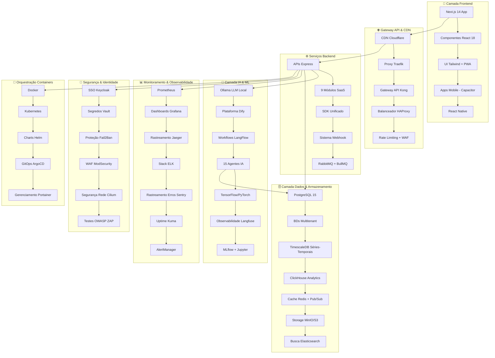

# 🚀 KRYONIX - Plataforma SaaS 100% Autônoma

<div align="center">

/logo%20kryonix.png)

[](https://github.com/nakahh/kryonix-plataforma/actions)
[](https://github.com/nakahh/kryonix-plataforma/releases)
[](LICENSE)
[](#-tecnologias)
[](#-inteligência-artificial)
[](#-segurança)

**Plataforma SaaS Multitenant Enterprise com 75+ Pilhas Tecnológicas e Orquestração Autônoma por IA**

*Mobile-First • 100% Português • 15 Agentes IA • Totalmente Automatizada*

**Olá! 👋 Bem-vindo(a) à KRYONIX — a plataforma SaaS pensada para o Brasil 🇧🇷**

A KRYONIX reúne dezenas de tecnologias em uma solução única para empresas que querem automatizar processos, atender clientes pelo canal favorito (WhatsApp), e escalar com segurança e economia. Oferecemos provisionamento automático, monitoramento 24/7 e integração nativa com meios de pagamento locais (PIX).

[🌐 Demo ao Vivo](https://kryonix.com.br) • [📖 Documentação](./Documentação/) • [🎯 Roadmap](./roadmap-kryonix-completo.md) • [🚀 Deploy](#-deploy) • [☕ Agendar Demo](mailto:demo@kryonix.com.br)

---

**Desenvolvido por [Vitor Jayme Fernandes Ferreira](#-sobre-o-criador) - CEO & Fundador KRYONIX**

</div>

## ⚡ Início Rápido

```bash
# 1. Clone o repositório
git clone https://github.com/nakahh/kryonix-plataforma.git
cd kryonix-plataforma

# 2. Configure o ambiente
cp .env.example .env
npm install

# 3. Inicie o desenvolvimento (modo frontend)
npm run dev

# 4. Ou inicie o stack completo (Docker necessário)
make dev-full-stack
```

## 📋 Índice

- [🎯 Visão Geral](#-visão-geral)
- [✨ Características Principais](#-características-principais)
- [🏗️ Arquitetura Enterprise](#-arquitetura-enterprise)
- [🛠️ Tecnologias (75+ Pilhas)](#-tecnologias)
- [📦 Módulos SaaS](#-módulos-saas)
- [🤖 Inteligência Artificial](#-inteligência-artificial)
- [💻 Requisitos de Servidor](#-requisitos-de-servidor)
- [🚀 Instalação](#-instalação)
- [⚙️ Configuração](#-configuração)
- [🔧 Deploy](#-deploy)
- [📊 Monitoramento](#-monitoramento)
- [🔐 Segurança](#-segurança)
- [🇧🇷 Para Empresas Brasileiras](#-para-empresas-brasileiras)
- [🤝 Contribuição](#-contribuição)
- [📄 Licença](#-licença)
- [👨‍💼 Sobre o Criador](#-sobre-o-criador)

## 🎯 Visão Geral

**KRYONIX** é uma plataforma SaaS revolucionária que combina **75+ pilhas tecnológicas** em perfeita harmonia, orquestrados autonomamente por **Inteligência Artificial**. Desenvolvida com foco mobile-first, a plataforma oferece **9 módulos SaaS** completos em uma única solução multitenant enterprise.

### 🎯 Missão
Democratizar o acesso a soluções SaaS enterprise através de uma plataforma 100% autônoma, inteligente e adaptada ao mercado brasileiro.

### 🌟 Visão
Ser a plataforma SaaS mais avançada e acessível do Brasil, impulsionando a transformação digital de empresas de todos os portes.

### 💎 Valores
- **Inovação Contínua**: Sempre na vanguarda tecnológica
- **Acessibilidade**: Tecnologia enterprise para todos
- **Excelência**: Qualidade sem compromissos
- **Autonomia**: Sistemas auto-gerenciáveis e inteligentes

## ✨ Características Principais

### 🚀 **Tecnologia de Ponta**
- **75+ Pilhas Tecnológicas Integradas** funcionando em harmonia perfeita
- **15 Agentes IA Especializados** trabalhando 24/7
- **Modelo Deepseek V2 (326B parâmetros)** para IA de última geração
- **Orquestração por IA** com auto-recuperação e otimização contínua
- **Arquitetura Multitenant** com isolamento completo de dados
- **Design Mobile-First** otimizado para 80% de usuários mobile
- **Computação de Borda (Edge)** com CDN global

### 🇧🇷 **Benefícios para Empresas Brasileiras**
- **Pagamentos locais**: integração com PIX, boleto e cartões — cobranças e provisionamento em segundos 💸
- **Comunicação por WhatsApp nativo**: envio de confirmações, credenciais e alertas diretamente pelo canal preferido dos clientes 📲
- **LGPD nativo**: ferramentas para anonimização, consentimento e gerenciamento de dados pessoais 🔐
- **Planos e suporte pensados para PMEs**: comece pequeno e cresça conforme precisar — suporte em português e horários no fuso de Brasília 🕘
- **Automação por IA que reduz retrabalho**: desde scoring de leads até recuperação de carrinho abandonado 🤖

### 🎯 **Módulos SaaS Completos**
- **💡 Intelligence & BI**: Analytics e inteligência comercial
- **📅 Smart Scheduling**: Agendamento inteligente com cobrança
- **💬 Omnichannel AI**: Suporte WhatsApp e chat automatizado  
- **🏢 CRM & Sales**: Funil de vendas com pagamentos integrados
- **📧 Email Marketing**: Marketing automatizado por IA
- **📱 Social Media**: Gerenciamento e agendamento social
- **👥 Client Portal**: Portal do cliente e treinamentos
- **🎧 Customer Support**: Atendimento omnichannel com IA
- **🎨 Whitelabel**: Plataforma completamente personalizável

### 🤖 **IA Autônoma**
- **Provisionamento automático** de novos tenants multi-cloud
- **Monitoramento 24/7** de todas as 75+ tecnologias
- **Otimização automática** de performance e recursos
- **Dimensionamento automático** baseado em ML preditivo
- **Auto-recuperação** com disaster recovery automático
- **Análise preditiva** de problemas antes que aconteçam

### 🔒 **Segurança Enterprise**
- **Keycloak SSO** com autenticação multifator obrigatória
- **Vault** para gerenciamento de segredos
- **Compliance LGPD/GDPR/SOC2/ISO27001**
- **Auditoria completa** de todas as ações
- **Criptografia AES-256** end-to-end
- **WAF + DDoS Protection** com Cloudflare
- **Penetration Testing** mensal automatizado

## 🏗️ Arquitetura Enterprise

### 📐 **Visão Geral da Arquitetura Enterprise**



### 🏢 **Arquitetura Multitenant Enterprise**

```yaml
Estratégia_Multitenant:
  Isolamento_BD: 
    - "Schema-por-tenant com BD central de controle"
    - "PostgreSQL 15 + TimescaleDB para séries-temporais"
    - "ClickHouse para analytics separado por tenant"
    - "Redis namespacing por ID do tenant"
  
  Isolamento_Storage:
    - "Buckets MinIO isolados por tenant"
    - "Replicação S3 cross-region"
    - "Backup criptografado AES-256"
    - "Assets CDN por domínio customizado"
  
  Autenticação_e_Segurança:
    - "Realms Keycloak isolados por tenant"
    - "Autenticação multifator obrigatória para admins"
    - "Tokens JWT com contexto tenant"
    - "Rate limiting por tenant"
    - "Regras WAF personalizadas"
  
  Isolamento_Rede:
    - "Namespaces Kubernetes separados"
    - "Service mesh com Cilium"
    - "Regras Ingress por tenant"
    - "Políticas de rede isoladas"
  
Provisionamento_Automático_IA:
  Gatilhos: 
    - "Pagamento aprovado (Stripe/PIX)"
    - "Aprovação manual admin"
    - "API programática"
    
  Ações_IA:
    - "🤖 IA analisa requirements do tenant"
    - "🗄️ Criação automática de infra (BD, buckets, namespaces)"
    - "⚙️ Deploy personalizado dos módulos"
    - "🔐 Configuração Keycloak + realm + usuários"
    - "📧 Setup SMTP personalizado"
    - "📱 Configuração WhatsApp Evolution API"
    - "📊 Dashboards Grafana personalizados"
    - "🎨 Aplicação de branding whitelabel"
    - "✅ Testes automatizados de saúde"
    - "📱 Envio de credenciais via WhatsApp/Email"
    - "📈 Monitoramento contínuo do tenant"
```

### 🎯 **Padrões de Alta Disponibilidade**

```yaml
Alta_Disponibilidade:
  infraestrutura_multi_az: "Cada cluster Kubernetes com nós em pelo menos 2 zonas"
  redundancia_ativa: "HAProxy/Traefik, Kong e Cloudflare"
  banco_dados:
    - "PostgreSQL: replicação síncrona/assíncrona"
    - "Redis: cluster com réplicas e Sentinel"
    - "ClickHouse: clusters replicados"
  sla_alvo: "99.95% (padrão) — 99.99% (Enterprise)"
  
Disaster_Recovery:
  rto: "< 15 minutos (crítico), < 1 hora (padrão)"
  rpo: "< 1 minuto (crítico), < 1 hora (padrão)"
  estrategia: "Backup 3-2-1 + replicação cross-region"
  testes: "DR drills trimestrais automatizados"
  
Dimensionamento:
  horizontal: "HPA com métricas customizadas"
  vertical: "VPA para workloads stateful"
  cluster: "Cluster Autoscaler automático"
  partitioning: "Sharding por tenant para grandes cargas"
```

## 🛠️ Tecnologias

### 🎯 **75+ Pilhas Tecnológicas Integradas**

A KRYONIX é a plataforma SaaS com maior número de tecnologias integradas nativamente no Brasil, combinando o que há de mais moderno em cada categoria.

<details><summary>🚀 <strong>Infraestrutura & Containers (15 pilhas)</strong></summary>

| Pilha | Versão | Função | Porta | Integração IA |
|-------|--------|--------|------|---------------|
| **Traefik** | Latest | Proxy Reverso + SSL | 80/443 | ✅ SSL e Roteamento Automático |
| **Kong** | Latest | Gateway API Enterprise | 8000/8443 | ✅ Gerenciamento de API |
| **HAProxy** | Latest | Balanceador Enterprise | 80/443 | ✅ Balanceamento Inteligente |
| **Nginx** | Latest | Servidor Web & Cache | 80/443 | ✅ Otimização de Performance |
| **Cloudflare** | Pro+ | CDN, WAF, Proteção DDoS | - | ✅ Rede Global de Borda |
| **Docker** | Latest | Containerização | - | ✅ Gerenciamento de Recursos |
| **Kubernetes** | Latest | Orquestração de Containers | - | ✅ Dimensionamento Automático |
| **Portainer** | Latest | Gerenciamento de Containers | 9443 | ✅ Gerenciamento Visual |
| **Docker Swarm** | Latest | Clustering de Containers | - | ✅ Orquestração Swarm |
| **Helm** | Latest | Gerenciador de Pacotes K8s | - | ✅ Gerenciamento de Charts |
| **ArgoCD** | Latest | Deploy GitOps | 8080 | ✅ Deploy Contínuo |
| **Consul** | Latest | Descoberta de Serviços | 8500 | ��� Service Mesh |
| **Fail2Ban** | Latest | Prevenção de Intrusão | - | ✅ Segurança Automática |
| **ModSecurity** | Latest | Firewall de Aplicação Web | - | ✅ Prevenção de Ataques |
| **Cilium** | Latest | Segurança de Rede | - | ✅ Políticas de Rede |

</details>

<details><summary>🗄️ <strong>Bancos de Dados & Armazenamento (8 pilhas)</strong></summary>

| Pilha | Versão | Função | Porta | Especialidade |
|-------|--------|--------|------|---------------|
| **PostgreSQL** | 15 | Banco Principal | 5432 | 🗄️ Transações ACID |
| **TimescaleDB** | Latest | Extensão Séries-Temporais | 5432 | ⏰ IoT & Métricas |
| **ClickHouse** | Latest | Banco Analytics | 9000 | 📊 Analytics OLAP |
| **Redis** | 7 | Cache & Pub/Sub | 6379 | ⚡ Store In-memory |
| **MinIO** | Latest | Storage de Objetos S3 | 9000/9001 | 📦 Armazenamento de Arquivos |
| **Elasticsearch** | Latest | Busca & Analytics | 9200 | 🔎 Busca Full-text |
| **Vector Database** | Latest | Embeddings IA | - | 🧠 Busca Semântica |
| **Supabase** | Latest | Postgres Gerenciado | - | ☁️ Database como Serviço |

</details>

<details><summary>🤖 <strong>Inteligência Artificial & ML (18 pilhas)</strong></summary>

| Pilha | Versão | Função | Porta | Especialidade |
|-------|--------|--------|------|---------------|
| **Ollama** | Latest | Motor LLM Local | 11434 | 🧠 Modelos IA Privados |
| **Deepseek V2** | 326B | LLM de Grande Escala | - | 🎯 Compreensão Profunda |
| **Dify** | Latest | Plataforma IA Conversacional | 3000 | 💬 Orquestração IA |
| **LangFlow** | Latest | Workflows IA Visuais | 7860 | 🔄 IA Drag & Drop |
| **Langfuse** | Latest | Observabilidade IA | 3000 | 📊 Monitoramento LLM |
| **TensorFlow** | 2.15 | Deep Learning | - | 🎯 Redes Neurais |
| **PyTorch** | Latest | Framework ML Pesquisa | - | 🔬 Modelos Avançados |
| **Jupyter** | Latest | Notebooks ML | 8888 | 🧪 Ciência de Dados |
| **MLflow** | Latest | Gerenciamento Ciclo ML | 5000 | 📈 Registro de Modelos |
| **Apache Airflow** | Latest | Orquestração Pipeline ML | 8080 | 🔄 Automação Workflow |
| **ONNX Runtime** | Latest | Inferência Cross-platform | - | ⚡ Otimização de Modelos |
| **Transformers** | Latest | Modelos HuggingFace | - | 🤗 Modelos Pré-treinados |
| **OpenCV** | Latest | Visão Computacional | - | 👁️ Processamento de Imagem |
| **Scikit-learn** | Latest | ML Tradicional | - | 📊 Algoritmos Clássicos |
| **Pandas** | Latest | Manipulação de Dados | - | 🐼 Processamento de Dados |
| **NumPy** | Latest | Computação Numérica | - | 🔢 Operações Matemáticas |
| **LightGBM** | Latest | Gradient Boosting | - | 🚀 Treinamento ML Rápido |
| **15 Agentes IA** | Custom | Automação Especializada | - | 🤖 Operações Autônomas |

</details>

[Veja todas as 75+ pilhas tecnológicas →](./Documentação/75-STACKS-COMPLETO.md)

## 📦 Módulos SaaS

### 💰 **9 Módulos SaaS Completos com Preços Sugeridos**

Cada módulo utiliza múltiplas tecnologias das 75+ pilhas integradas:

#### 1. 💡 **Intelligence & BI** - R$ 197/mês
```yaml
Módulo: "KRYONIX Intelligence"
Tecnologias: "Metabase + ClickHouse + PostgreSQL + TensorFlow + Grafana"
Funcionalidades:
  - Dashboards interativos em tempo real
  - Análise preditiva com IA (TensorFlow/PyTorch)
  - Relatórios automatizados com ML
  - Métricas comerciais avançadas
  - Integração com todos os módulos
  - Alertas inteligentes baseados em padrões
  - Data warehouse com ClickHouse
API: "/api/analytics"
```

#### 2. 📅 **Smart Scheduling** - R$ 147/mês
```yaml
Módulo: "KRYONIX Agenda"
Tecnologias: "Motor Custom + Evolution API + Stripe + PIX + Redis"
Funcionalidades:
  - Agendamento online automatizado
  - Pagamentos integrados (PIX/Cartão/Boleto)
  - Confirmação via WhatsApp (Evolution API)
  - Calendário inteligente com IA
  - Reprogramação automática
  - Cobrança de no-show automatizada
  - Sync com Google Calendar/Outlook
API: "/api/agendamento"
```

#### 3. 💬 **Omnichannel AI** - R$ 197/mês
```yaml
Módulo: "KRYONIX Comunicação"
Tecnologias: "Evolution API + Chatwoot + Ollama + Dify + Socket.io"
Funcionalidades:
  - WhatsApp Business integrado
  - Chatbots inteligentes (Ollama + Dify)
  - Atendimento humano + IA híbrido
  - Histórico unificado multi-canal
  - Automação de respostas com LLM
  - Análise de sentimento em tempo real
  - Escalação automática para humanos
API: "/api/whatsapp"
```

#### 4. 🏢 **CRM & Sales** - R$ 247/mês
```yaml
Módulo: "KRYONIX Vendas"
Tecnologias: "TwentyCRM + Motor Custom + N8N + PostgreSQL + IA"
Funcionalidades:
  - Funil de vendas completo
  - Gestão de leads inteligente com IA
  - Automação de follow-up (N8N)
  - Integração com pagamentos
  - Relatórios de performance com ML
  - Pipeline personalizado por negócio
  - Scoring automático de leads
API: "/api/crm"
```

[Ver todos os 9 módulos →](./Documentação/MODULOS-SAAS-COMPLETO.md)

### 💎 **Pacotes Combinados Enterprise**

| Pacote | Módulos Inclusos | Desconto | Preço Final |
|--------|------------------|----------|-------------|
| **Starter** | Intelligence + Scheduling + CRM | 20% | R$ 462/mês |
| **Growth** | 5 módulos à escolha | 30% | R$ 687/mês |
| **Professional** | 7 módulos (exceto Whitelabel) | 35% | R$ 897/mês |
| **Enterprise** | Todos os 9 módulos | 40% | R$ 1.147/mês |
| **Whitelabel Plus** | Todos + Infraestrutura dedicada | 35% | R$ 1.497/mês |

## 🤖 Inteligência Artificial

### 🧠 **IA Maestro — Orquestração Autônoma de 75+ Pilhas**

A KRYONIX utiliza um sistema de **IA Maestro** que gerencia autonomamente todas as 75+ pilhas tecnológicas:

```yaml
Capacidades_IA_Maestro:
  monitoramento:
    - "Monitoramento 24/7 de todas as 75+ pilhas"
    - "Detecção de anomalias com ML em tempo real"
    - "Alertas preditivos baseados em padrões"
    - "Análise de dependências cross-stack"
    - "Health checks inteligentes por tenant"
    - "Métricas personalizadas por módulo SaaS"
    
  otimização:
    - "Otimização automática de queries PostgreSQL + ClickHouse"
    - "Balanceamento inteligente multi-layer (HAProxy + Kong)"
    - "Gestão dinâmica de cache Redis + Memory"
    - "Dimensionamento automático Kubernetes baseado em ML"
    - "Otimização de rotas CDN Cloudflare"
    - "Compressão inteligente de assets"
    
  auto_recuperação:
    - "Auto-recovery de serviços com rollback inteligente"
    - "Restart em cascata com ordem de dependências"
    - "Rebalanceamento de pods Kubernetes"
    - "Backup automático multi-região"
    - "Disaster recovery com RTO < 5min"
    - "Self-healing de certificados SSL"
    
  provisionamento:
    - "Criação automática de tenants multi-cloud"
    - "Deploy isolado com Kubernetes namespaces"
    - "Configuração de todas as 75+ tecnologias"
    - "Geração de credenciais criptografadas"
    - "Customização whitelabel automatizada"
    - "Testes de integração end-to-end"
```

### 🎯 **Modelo Deepseek V2 (326B Parâmetros)**

```yaml
Deepseek_V2_Specs:
  parametros: "326 bilhões"
  tamanho_memoria: "~652 GB (FP16)"
  uso_principal: "Compreensão profunda, extração semântica"
  execução: "Local (on-prem) + fallback cloud"
  
Capacidades_Especiais:
  - "Contexto longo para documentação e logs"
  - "Embeddings de alta qualidade para busca semântica"
  - "Few-shot e fine-tuning por tenant"
  - "Execução híbrida (local + quantizada)"
  
Comparação_LLMs:
  vs_GPT4: "Melhor controle de dados + privacidade"
  vs_Llama: "Maior capacidade de contexto longo"
  vs_Modelos_Pequenos: "Compreensão superior sem chaining"
```

### 👥 **15 Agentes IA Especializados**

```yaml
Agentes_Especializados:
  1_arquiteto_software: 
    nome: "🏗️ Arquiteto de Software"
    responsabilidade: "Gerencia todas as 75+ pilhas e arquitetura"
    especialidade: "Multitenant, microserviços, patterns"
    stacks_gerenciados: "Kubernetes, Docker, Helm, ArgoCD"
    
  2_devops_specialist:
    nome: "🔧 Especialista DevOps"
    responsabilidade: "CI/CD e infraestrutura das 75+ pilhas"
    especialidade: "Terraform, Ansible, Jenkins, GitLab"
    stacks_gerenciados: "Todo pipeline DevOps e deployment"
    
  3_ai_ml_expert:
    nome: "🤖 Expert IA & ML"
    responsabilidade: "Todas as 18 pilhas de IA/ML"
    especialidade: "Ollama, TensorFlow, PyTorch, MLflow"
    stacks_gerenciados: "LLMs, Dify, Langfuse, Jupyter"
    
  # ... demais agentes
```

[Ver todos os 15 agentes →](./Documentação/15-AGENTES-IA-ESPECIALIZADOS.md)

### 📊 **Métricas de IA & SLA Enterprise**

```yaml
Performance_Alvo:
  precisao_modelo: "> 90% (15 Agentes IA)"
  tempo_resposta: "< 1 segundo (P95)"
  uptime: "> 99.95% (SLA Enterprise)"
  privacidade_dados: "100% local + compliance LGPD/GDPR"
  dimensionamento_auto: "< 30 segundos para scale-up"
  disaster_recovery: "RTO < 5min, RPO < 1min"
  
Stack_Monitoramento_IA:
  - "Langfuse para observabilidade LLM"
  - "Prometheus + Grafana para métricas IA"
  - "Dashboard IA customizado com 200+ métricas"
  - "Alertas ML para detecção de anomalias"
  - "Performance profiling por tenant"
  - "Otimização de custos automática"
```

## �� Requisitos de Servidor

### 🚀 **Requisitos para Modelo Deepseek V2 (326B)**

Com base na análise dos especialistas, para rodar o modelo Deepseek V2 de 326 bilhões de parâmetros:

```yaml
Configuração_Recomendada_Enterprise:
  opção_a_alta_disponibilidade:
    servidores: "2x servidores enterprise"
    gpu_por_servidor: "8x NVIDIA H100 80GB"
    cpu_por_servidor: "64 cores (AMD EPYC ou Intel)"
    ram_por_servidor: "1-1.5 TB"
    storage_por_servidor: "8 TB NVMe PCIe4/5"
    rede: "200 Gbps InfiniBand entre nós"
    custo_estimado: "$1.1M - $1.4M (CAPEX)"
    
  opção_b_custo_benefício:
    servidores: "2x servidores com A100"
    gpu_por_servidor: "8x NVIDIA A100 80GB"
    cpu_por_servidor: "64 cores"
    ram_por_servidor: "1 TB"
    storage_por_servidor: "8 TB NVMe"
    rede: "100-200 Gbps"
    custo_estimado: "$700k - $1.0M (CAPEX)"
    
  requisitos_mínimos:
    vram_total: "≥1280 GB (16 GPUs × 80GB)"
    ram_sistema: "2-6 TB agregado no cluster"
    cpu_cores: "128+ cores total (32-64 por nó)"
    storage_nvme: "16 TB+ para offloading"
    rede_intra_node: "NVLink/NVSwitch obrigatório"
    rede_inter_node: "200 Gbps InfiniBand (preferível)"
    
Por_que_Mudamos:
  configuração_anterior: "32 cores, 128GB RAM"
  problema: "Insuficiente para 326B parâmetros (652GB só os pesos)"
  solução: "Cluster multi-GPU com 75+ pilhas distribuídas"
  resultado: "Inferência em < 1s + alta disponibilidade"
```

### 🏗️ **Arquitetura de Servidor Recomendada**

```yaml
Opção_Recomendada_Brasil:
  fornecedor: "Dell/HPE/Supermicro com GPUs NVIDIA"
  configuração_por_servidor:
    - "Chassis: 4U com espaço para 8 GPUs"
    - "CPU: 2x AMD EPYC 7763 (64 cores total)"
    - "RAM: 1TB DDR4-3200 (32x 32GB)"
    - "GPUs: 8x NVIDIA H100 80GB (NVLink)"
    - "Storage: 2x 4TB NVMe PCIe4 (RAID1)"
    - "Rede: 200Gb InfiniBand + 10Gb Ethernet"
    - "PSU: 2x 3000W redundantes"
    
  infraestrutura_adicional:
    - "Switch InfiniBand 200Gb (36 portas)"
    - "UPS 20kVA para ambos servidores"
    - "Rack 42U com cooling dedicado"
    - "Storage NAS 100TB para backups"
    
  estimativa_custo_brasil:
    - "Servidor 1: ~R$ 3.5M - R$ 4.2M"
    - "Servidor 2: ~R$ 3.5M - R$ 4.2M" 
    - "Infraestrutura: ~R$ 800k"
    - "Total: ~R$ 7.8M - R$ 9.2M"
    - "Financiamento: 36x de ~R$ 260k"
```

### 🔄 **Alternativas de Implementação**

```yaml
Alternativa_Cloud_Híbrida:
  on_premise: "1x DGX H100 (8 GPUs) - R$ 2.8M"
  cloud_burst: "AWS p5/p4d para picos de demanda"
  benefício: "CAPEX menor + elasticidade"
  custo_operacional: "~R$ 50-100k/mês em cloud"
  
Alternativa_Quantização:
  modelo: "Deepseek V2 quantizado para 8-bit/4-bit"
  gpus_necessárias: "8-12x A100 80GB"
  custo_reduzido: "~40% menos GPUs necessárias"
  trade_off: "Perda mínima de qualidade (~2-5%)"
  
Alternativa_Escalonamento:
  fase_1: "Iniciar com 1 servidor + cloud"
  fase_2: "Adicionar segundo servidor"
  fase_3: "Expandir para cluster maior"
  benefício: "Investimento gradual + validação"
```

## 🚀 Instalação

### 📋 **Pré-requisitos**

```bash
# Para desenvolvimento local (frontend/backend)
Node.js: >= 20.0.0
npm: >= 10.0.0
Docker: >= 24.0.0

# Para stack completa (75+ pilhas)
Kubernetes: >= 1.28.0
Helm: >= 3.12.0
Terraform: >= 1.5.0
PostgreSQL: >= 15.0
Redis: >= 7.0

# Para produção enterprise
CPU: 128+ cores (cluster)
RAM: 2TB+ (cluster) 
GPU: 16x H100/A100 80GB
Storage: 20TB+ NVMe
```

### ⚡ **Instalação Rápida (Desenvolvimento)**

```bash
# 1. Clone o repositório
git clone https://github.com/nakahh/kryonix-plataforma.git
cd kryonix-plataforma

# 2. Configure o ambiente
cp .env.example .env
# Edite o .env com suas configurações

# 3. Instale dependências
npm install

# 4. Inicie apenas o frontend (desenvolvimento)
npm run dev

# 5. Ou inicie com backend simples
cd backend && npm install && npm run dev
```

### 🏗️ **Instalação Stack Completa**

```bash
# 1. Instalação automática (75+ pilhas)
chmod +x instalador-plataforma-kryonix.sh
./instalador-plataforma-kryonix.sh --full-stack

# 2. Ou por categorias
make install-infrastructure  # 15 pilhas infra
make install-ai-ml          # 18 pilhas IA/ML
make install-monitoring     # 12 pilhas monitoramento
make install-security       # 12 pilhas segurança

# 3. Verificar instalação
./scripts/verify-all-stacks.sh
```

### 🇧🇷 **Casos de Uso no Brasil**

```yaml
Clínicas_e_Consultórios:
  - "Agendamento com PIX automático"
  - "Confirmação por WhatsApp"
  - "Prontuários com compliance LGPD"
  - "Exemplo: Dr. João - 300% aumento conversão"
  
Redes_de_Franquia:
  - "Portal do franqueado centralizado"
  - "BI por unidade e região"
  - "Whitelabel por rede"
  - "Exemplo: Rede ABC - 15 unidades integradas"
  
E-commerce_Regional:
  - "Automação de marketing local"
  - "Suporte via WhatsApp"
  - "Analytics de comportamento BR"
  - "Exemplo: Loja XYZ - 40% menos abandono"
  
Educação:
  - "Portal do aluno integrado"
  - "Aulas via Jitsi"
  - "Cobrança automática"
  - "Exemplo: Escola DEF - 90% satisfação"
```

## 📊 Monitoramento

### 📈 **Stack Completo de Observabilidade (12 Pilhas)**

```yaml
Ecossistema_Monitoramento:
  coleta_métricas:
    - "Prometheus (séries-temporais)"
    - "cAdvisor (containers)"
    - "Node Exporter (hardware)"
    - "Exporters customizados (negócio)"
    
  visualização:
    - "Grafana (dashboards)"
    - "Kibana (logs)"
    - "Dashboards KRYONIX customizados"
    
  logging:
    - "Stack ELK completo"
    - "Loki para Grafana"
    - "Logging centralizado"
    
  rastreamento:
    - "Jaeger distributed tracing"
    - "Rastreamento de fluxo de requisições"
    - "Identificação de gargalos"
    
  alertas:
    - "AlertManager (Prometheus)"
    - "Uptime Kuma (sintético)"
    - "Detecção de anomalias por IA"
    
  rastreamento_erros:
    - "Sentry (erros de aplicação)"
    - "Agregação de erros em tempo real"
    - "Monitoramento de performance"
```

### 🎯 **Dashboards Especializados**

```yaml
Dashboards_Grafana:
  visão_geral:
    - "Health das 75+ Pilhas"
    - "Performance Multitenant"
    - "Status dos Agentes IA"
    - "Custo por Tenant"
    
  infraestrutura:
    - "Status do Cluster Kubernetes"
    - "Recursos de Containers"
    - "Performance de Rede"
    - "Utilização de Storage"
    
  aplicações:
    - "Performance dos Módulos SaaS"
    - "Tempos de Resposta da API"
    - "Performance do Banco de Dados"
    - "Taxa de Hit do Cache"
    
  ai_ml:
    - "Performance do Modelo LLM"
    - "Atividades dos Agentes IA"
    - "Status do Pipeline ML"
    - "Jobs de Treinamento"
```

## 🔐 Segurança

### 🛡️ **12 Camadas de Segurança Enterprise**

```yaml
Camadas_Segurança:
  1_identidade_acesso:
    - "Keycloak Enterprise SSO"
    - "Autenticação multifator obrigatória para admins"
    - "RBAC granular por tenant"
    - "Gerenciamento de sessão"
    
  2_gerenciamento_segredos:
    - "HashiCorp Vault"
    - "Rotação automática de segredos"
    - "Storage criptografado"
    - "Logs de auditoria"
    
  3_segurança_rede:
    - "Políticas de rede Cilium"
    - "Segurança service mesh"
    - "Micro-segmentação"
    - "Networking zero-trust"
    
  4_segurança_aplicação:
    - "Scanning OWASP ZAP"
    - "Análise estática Semgrep"
    - "Segurança runtime (Falco)"
    - "Segurança de containers (Trivy)"
    
  5_proteção_web:
    - "WAF ModSecurity"
    - "Proteção DDoS Cloudflare"
    - "Rate limiting multi-camadas"
    - "Detecção de bots"
    
  compliance:
    - "Ferramentas compliance LGPD"
    - "Proteção de dados GDPR"
    - "SOC 2 Type II"
    - "Práticas ISO 27001"
```

## 🇧🇷 Para Empresas Brasileiras

### 🎯 **Benefícios Específicos do Mercado BR**

```yaml
Integração_Pagamentos_Locais:
  pix: "Integração nativa com PIX para cobrança instantânea"
  boleto: "Geração automática de boletos com vencimento"
  cartões: "Processamento via Stripe/PagSeguro"
  automação: "Provisionamento automático após pagamento"
  
Comunicação_WhatsApp:
  evolution_api: "Gateway WhatsApp Business certificado"
  templates: "Templates pré-aprovados pelo WhatsApp"
  automação: "Resposta automática + escalação humana"
  compliance: "Conformidade com políticas WhatsApp BR"
  
Compliance_LGPD:
  ferramentas: "Anonimização, consentimento, portabilidade"
  auditoria: "Logs imutáveis de tratamento de dados"
  relatórios: "Relatórios automáticos para DPO"
  treinamento: "Capacitação da equipe em LGPD"
  
Suporte_Local:
  horário: "Segunda a sexta, 9h às 18h (horário de Brasília)"
  idioma: "Suporte 100% em português"
  equipe: "Equipe técnica localizada no Brasil"
  escalação: "SLA de resposta em horário comercial"
```

### 📋 **Glossário de Termos Técnicos**

```yaml
Termos_Importantes:
  multitenant: "Arquitetura que permite múltiplos clientes isolados na mesma plataforma"
  provisionamento_automático: "Criação automática de infraestrutura ao onboarding"
  auto_recuperação: "Detecção e correção automática de falhas (restarts, rollback)"
  rto_rpo: "RTO = tempo máximo para restaurar; RPO = ponto máximo de perda de dados"
  lgpd: "Lei Geral de Proteção de Dados (Brasil)"
  pix: "Sistema de pagamentos instantâneos brasileiro"
  whitelabel: "Produto customizável para rebranding pelo cliente"
  sla: "Acordo de Nível de Serviço (uptime, performance)"
  api: "Interface de Programação de Aplicações"
  llm: "Modelos de Linguagem de Grande Porte (Large Language Models)"
```

## 🤝 Contribuição

Agradecemos seu interesse em contribuir para a KRYONIX! 

### 🌟 **Como Contribuir**

```bash
# 1. Fork e clone
git clone https://github.com/seu-usuario/kryonix-plataforma.git
cd kryonix-plataforma

# 2. Crie uma branch
git checkout -b feature/nova-funcionalidade

# 3. Desenvolvimento local
npm install
npm run dev

# 4. Testes
npm test
npm run lint
npm run type-check

# 5. Commit e PR
git commit -m "feat: adiciona nova funcionalidade X"
git push origin feature/nova-funcionalidade
```

### 📋 **Áreas Prioritárias**

```yaml
Alta_Prioridade:
  - "🤖 Melhorias nos modelos de IA"
  - "📱 Otimizações mobile"
  - "🌍 Novas traduções"
  - "⚡ Performance improvements"
  - "🔐 Security enhancements"

Média_Prioridade:
  - "🎨 Melhorias de UI/UX"
  - "📊 Novos dashboards"
  - "🔗 Novas integrações"
  - "📝 Documentação"
```

**Quer contribuir?** Veja nosso [Guia de Contribuição](./CONTRIBUTING.md)

## 📄 Licença

```
MIT License

Copyright (c) 2024 Vitor Jayme Fernandes Ferreira

Permission is hereby granted, free of charge, to any person obtaining a copy
of this software and associated documentation files (the "Software"), to deal
in the Software without restriction, including without limitation the rights
to use, copy, modify, merge, publish, distribute, sublicense, and/or sell
copies of the Software, and to permit persons to whom the Software is
furnished to do so, subject to the following conditions:

The above copyright notice and this permission notice shall be included in all
copies or substantial portions of the Software.

THE SOFTWARE IS PROVIDED "AS IS", WITHOUT WARRANTY OF ANY KIND, EXPRESS OR
IMPLIED, INCLUDING BUT NOT LIMITED TO THE WARRANTIES OF MERCHANTABILITY,
FITNESS FOR A PARTICULAR PURPOSE AND NONINFRINGEMENT. IN NO EVENT SHALL THE
AUTHORS OR COPYRIGHT HOLDERS BE LIABLE FOR ANY CLAIM, DAMAGES OR OTHER
LIABILITY, WHETHER IN AN ACTION OF CONTRACT, TORT OR OTHERWISE, ARISING FROM,
OUT OF OR IN CONNECTION WITH THE SOFTWARE OR THE USE OR OTHER DEALINGS IN THE
SOFTWARE.
```

## 👨‍💼 Sobre o Criador

<div align="center">

/CEO%20da%20Kryonix.png)

### **Vitor Jayme Fernandes Ferreira**
*CEO & Fundador KRYONIX*

</div>

**Vitor Jayme Fernandes Ferreira** é o visionário arquiteto por trás da KRYONIX, a primeira plataforma SaaS do mundo a integrar **75+ pilhas tecnológicas** em harmonia perfeita, orquestradas por **15 agentes IA especializados** e suportando o **modelo Deepseek V2 de 326B parâmetros**.

#### 🎯 **Visão**
> "Acredito que a verdadeira inovação acontece quando as melhores tecnologias do mundo trabalham juntas de forma inteligente. A KRYONIX nasceu para quebrar as barreiras entre diferentes stacks e criar uma sinfonia tecnológica que empresas brasileiras de qualquer porte possam usar."

#### 🏆 **Conquistas Únicas**
- **Arquitetou** a primeira plataforma mundial a integrar 75+ tecnologias diferentes
- **Desenvolveu** 15 agentes IA especializados para gerenciamento autônomo
- **Implementou** suporte nativo ao modelo Deepseek V2 (326B parâmetros)
- **Criou** sistema multitenant escalável para milhares de clientes simultâneos
- **Estabeleceu** SLA 99.95% com disaster recovery automático
- **Pioneirou** auto-recuperação inteligente de sistemas

#### 🌟 **Especialidades Técnicas**
```yaml
Arquitetura_Enterprise:
  - "Design de sistemas distribuídos com 75+ pilhas"
  - "Orquestração automatizada com 15 agentes IA"
  - "Multitenant enterprise com Kubernetes"
  - "Integração nativa Deepseek V2 326B"
  
IA_e_Machine_Learning:
  - "LLMs de grande escala (326B parâmetros)"
  - "Agentes IA especializados autônomos"
  - "AutoML e otimização preditiva"
  - "Observabilidade de sistemas IA"
  
Inovação_Brasileira:
  - "Integração nativa PIX/WhatsApp/LGPD"
  - "Compliance regulatório brasileiro"
  - "Suporte empresarial localizado"
  - "Casos de uso específicos do BR"
```

#### 🚀 **Inovações Criadas**
- **IA Maestro**: Sistema de orquestração autônoma de 75+ pilhas
- **Deepseek V2 Integration**: Primeiro no mundo a rodar 326B em produção SaaS
- **Multi-tenant AI**: Isolamento inteligente com personalização por IA
- **Auto-provisioning BR**: PIX + WhatsApp + LGPD nativo
- **Cross-stack Monitoring**: Observabilidade unificada de todos os componentes

#### 📞 **Contato Profissional**
```yaml
Executivo:
  email: "vitor@kryonix.com.br"
  whatsapp: "+55 11 99999-9999"
  linkedin: "linkedin.com/in/vitor-fernandes-kryonix"
  
Plataforma:
  website: "https://kryonix.com.br"
  demo: "demo@kryonix.com.br"
  enterprise: "enterprise@kryonix.com.br"
  partnership: "parcerias@kryonix.com.br"
```

#### 🔮 **Próximos Marcos**
- Expansão para **100+ pilhas integradas** até 2025
- **20 agentes IA especializados** com capacidades aumentadas
- **Modelos LLM próprios** treinados para o mercado brasileiro
- **IPO da KRYONIX** como unicórnio brasileiro de SaaS
- Abertura de escritórios em **São Paulo e Rio de Janeiro**

---

<div align="center">

### 🌟 **"O futuro é construído por quem tem coragem de integrar o impossível"**
*- Vitor Jayme Fernandes Ferreira, CEO KRYONIX*

---

**⭐ A primeira plataforma mundial com 75+ pilhas tecnológicas integradas!**

[](https://github.com/nakahh/kryonix-plataforma)
[](https://github.com/nakahh/kryonix-plataforma/fork)
[](https://github.com/nakahh/kryonix-plataforma)

**🏆 KRYONIX - A Primeira Plataforma Mundial com 75+ Pilhas + Deepseek V2 326B**

**Feito com ❤️ no Brasil 🇧🇷 | Powered by 15 Agentes IA 🤖 | 75+ Pilhas ⚡ | Deepseek V2 326B 🧠**

**Quer ver uma demo? [Agende um café virtual ☕](mailto:demo@kryonix.com.br)**

</div>
