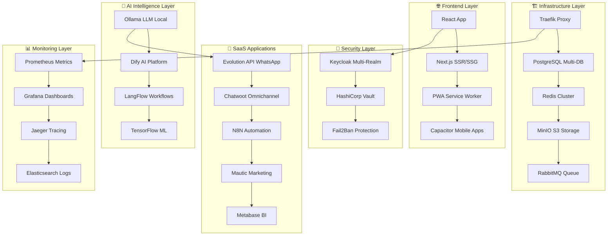

# 🚀 KRYONIX - SaaS Platform

<div align="center">

[](https://www.kryonix.com.br)
[](https://www.kryonix.com.br)
[](https://www.kryonix.com.br)
[](https://www.kryonix.com.br)

[](https://github.com/Nakahh/KRYONIX-PLATAFORMA)
[](LICENSE)
[](https://wa.me/5517981805327)

**🤖 Plataforma SaaS 100% Autônoma por Inteligência Artificial**  
*Ecossistema Tecnológico Inteligente para o Futuro dos Negócios Brasileiros*

[📊 Ver Progresso](https://www.kryonix.com.br/progresso) • [📚 Documentação](https://docs.kryonix.com.br) • [💬 WhatsApp](https://wa.me/5517981805327) • [🚀 Demo](https://demo.kryonix.com.br)

</div>

---

## 📋 Índice

<details>
<summary>🔍 Clique para expandir o índice completo</summary>

- [🎯 Visão Geral](#-visão-geral)
- [✨ Features Principais](#-features-principais)
- [🏗️ Arquitetura do Sistema](#️-arquitetura-do-sistema)
- [🚀 Quick Start](#-quick-start)
- [📡 APIs & Endpoints](#-apis--endpoints)
- [🛠️ Stack Tecnológico](#️-stack-tecnológico)
- [📱 Mobile & PWA](#-mobile--pwa)
- [🤖 Inteligência Artificial](#-inteligência-artificial)
- [🔐 Segurança & Compliance](#-segurança--compliance)
- [📊 Monitoramento & Analytics](#-monitoramento--analytics)
- [🗺️ Roadmap](#️-roadmap)
- [🤝 Contribuição](#-contribuição)
- [💬 Suporte](#-suporte)

</details>

---

## 🎯 Visão Geral

<div align="center">
  
</div>

**KRYONIX** é uma plataforma SaaS revolucionária que opera **100% de forma autônoma** através de **15 Agentes de Inteligência Artificial**, otimizada para **80% dos usuários que são mobile**, com interface completamente em **português brasileiro** para usuários leigos.

### 🌟 Diferenciais Únicos

<table>
<tr>
<td align="center">🤖<br><strong>IA 100% Autônoma</strong><br>Sistema que funciona sozinho</td>
<td align="center">📱<br><strong>Mobile-First</strong><br>80% usuários mobile prioritários</td>
<td align="center">🇧🇷<br><strong>100% Português</strong><br>Interface para brasileiros</td>
</tr>
<tr>
<td align="center">📊<br><strong>Dados Reais</strong><br>Zero mock ou simulação</td>
<td align="center">🔄<br><strong>Deploy Automático</strong><br>Sincronização contínua</td>
<td align="center">💬<br><strong>Multi-canal</strong><br>WhatsApp preferencial</td>
</tr>
</table>

### 📈 Progresso Atual

```
Progresso Implementação: [██░░░░░░░░░░░░░░░░░░░░░░░░░░░░░░░░░░░░░░░░░░░░░░░░░] 4%

✅ CONCLUÍDO:
├── Etapa Zero: Análise Completa do Projeto
└── Parte 01: Autenticação e Keycloak Multi-Tenant

🔄 EM ANDAMENTO:
├── Parte 02: Base de Dados PostgreSQL  
└── Criação do SDK @kryonix/sdk

⏳ PRÓXIMAS ENTREGAS:
├── Parte 03: Storage MinIO
├── Parte 04: Cache Redis
└── Parte 05: Proxy Reverso Traefik
```

---

## ✨ Features Principais

### 💎 8 Módulos SaaS Especializados

<div align="center">

| Módulo | Descrição | Preço | Status | Agente Responsável |
|--------|-----------|-------|--------|--------------------|
| 📊 **Inteligência Comercial** | Dashboard BI com IA preditiva | R$ 99/mês | 🟡 Planejado | 📊 Analista BI |
| 📅 **Agendamento IA** | Agenda inteligente + cobrança | R$ 119/mês | 🟡 Planejado | 🔄 Expert Automação |
| 💬 **Atendimento Omnichannel** | IA multimodal (voz, texto, imagem) | R$ 159/mês | 🟡 Planejado | 💬 Expert Comunicação |
| 🏢 **CRM & Vendas** | Pipeline + cobrança automática | R$ 179/mês | 🟡 Planejado | 📊 Analista BI |
| 📧 **Marketing IA** | Conteúdo generativo multicanal | R$ 219/mês | 🟡 Planejado | 💬 Expert Comunicação |
| 📱 **Redes Sociais** | Gestão automática + agendamento | R$ 239/mês | 🟡 Planejado | 💬 Expert Comunicação |
| 🎓 **Portal Cliente** | Treinamento + documentos | R$ 269/mês | 🟡 Planejado | 🎨 Designer UX/UI |
| 🎨 **Whitelabel** | Plataforma customizável | R$ 299/mês | 🟡 Planejado | 🏗️ Arquiteto Software |

</div>

### 🤖 15 Agentes IA Especializados

<details>
<summary>👥 Clique para ver a equipe completa de agentes</summary>

<div align="center">

| Agente | Especialidade | Responsabilidade Principal |
|--------|---------------|---------------------------|
| 🏗️ **Arquiteto Software Sênior** | Estrutura e integração | Padrões arquiteturais |
| 🔧 **DevOps Specialist** | Deploy e infraestrutura | CI/CD e automação |
| 🎨 **Designer UX/UI Principal** | Interface mobile-first | Experiência do usuário |
| 🧠 **Expert IA & ML** | Automação inteligente | Modelos e análise preditiva |
| 📊 **Analista Dados & BI** | Business Intelligence | Dashboards e métricas |
| 🔐 **Expert Segurança** | Proteção e compliance | Autenticação e criptografia |
| 📱 **Especialista Mobile** | Otimização mobile | PWA e apps nativos |
| 💬 **Expert Comunicação** | Omnichannel | WhatsApp e automação |
| 🗄️ **Arquiteto de Dados** | Estrutura de dados | Performance e modelagem |
| ⚡ **Expert Performance** | Otimização 60fps | Cache e load balancing |
| 🌐 **Especialista APIs** | Integrações | REST, GraphQL, SDK |
| 🧪 **QA Expert** | Qualidade garantida | Testes automatizados |
| 💼 **Specialist Business** | Métricas de negócio | KPIs e ROI |
| 🔄 **Expert Automação** | Workflows inteligentes | Processos automáticos |
| 🌍 **Specialist Localização** | 100% português | Cultura brasileira |

</div>

</details>

---

## 🏗️ Arquitetura do Sistema

### 🔧 32 Stacks Tecnológicos Integrados



### 🚀 Arquitetura Multi-Tenant

<div align="center">

```yaml
🏢 MULTI-TENANCY STRATEGY:
  database: "kryonix_cliente_{id}" # Isolamento completo
  authentication: "kryonix-cliente-{id}" # Realms Keycloak
  storage: "cliente-{id}-files" # Buckets MinIO
  cache: "cliente:{id}:*" # Namespaces Redis
  routing: "{cliente}.kryonix.com.br" # Subdomínios automáticos
```

</div>

---

## 🚀 Quick Start

### 📋 Pr��-requisitos

<div align="center">


</div>

```bash
# Dependências necessárias
🐳 Docker & Docker Compose (v20.10+)
🔧 Node.js 18+ com npm/yarn
🐍 Python 3.9+ com pip
🗄️ PostgreSQL 15+
🌐 Domínio kryonix.com.br configurado
📱 WhatsApp Business API (Evolution)
```

### ⚡ Instalação em 3 Passos

<details>
<summary>🔧 Clique para ver instruções completas</summary>

#### 1️⃣ Clone e Configure

```bash
# Clone o repositório
git clone https://github.com/Nakahh/KRYONIX-PLATAFORMA.git
cd KRYONIX-PLATAFORMA

# Configurar variáveis de ambiente
cp .env.example .env
nano .env
```

#### 2️⃣ Execute Setup Automático

```bash
# Setup completo automatizado
chmod +x scripts/setup-inicial.sh
./scripts/setup-inicial.sh

# Ou manual
npm install
docker-compose up -d
npm run setup:database
```

#### 3️⃣ Acesse a Plataforma

```bash
# Iniciar desenvolvimento
npm run dev

# Verificar status
curl https://www.kryonix.com.br/health
```

</details>

### 🐳 Deploy Produção com Docker

```yaml
# docker-compose.yml simplificado
version: '3.8'
services:
  kryonix-web:
    image: kryonix/platform:latest
    ports: ["5173:5173"]
    environment:
      NODE_ENV: production
      REACT_APP_API_URL: https://api.kryonix.com.br
    restart: always
    
  keycloak:
    image: quay.io/keycloak/keycloak:latest
    environment:
      KEYCLOAK_ADMIN: admin
      KEYCLOAK_ADMIN_PASSWORD: ${KEYCLOAK_PASSWORD}
    ports: ["8080:8080"]
    
  postgresql:
    image: postgres:15
    environment:
      POSTGRES_DB: kryonix_master
      POSTGRES_PASSWORD: ${DB_PASSWORD}
    volumes: ["postgres_data:/var/lib/postgresql/data"]
```

---

## 📡 APIs & Endpoints

### 🌐 Endpoints Principais

<div align="center">

| Endpoint | Descrição | Status | SSL | Performance |
|----------|-----------|---------|-----|-------------|
| `https://www.kryonix.com.br` | Homepage principal | ✅ Ativo | ✅ A+ | 🟢 <2s |
| `https://www.kryonix.com.br/progresso` | Monitor progresso | ✅ Ativo | ✅ A+ | 🟢 <1s |
| `https://api.kryonix.com.br` | API Gateway | 🟡 Dev | ✅ A+ | 🟡 <3s |
| `https://painel.kryonix.com.br` | Dashboard admin | 🟡 Planejado | ✅ A+ | ⏳ TBD |
| `https://keycloak.kryonix.com.br` | SSO Authentication | 🟡 Parte 01 | ✅ A+ | ⏳ TBD |

</div>

### 🔗 SDK @kryonix/sdk (Em Desenvolvimento)

```typescript
// Instalação
npm install @kryonix/sdk

// Configuração básica
import { KryonixSDK } from '@kryonix/sdk';

const kryonix = new KryonixSDK({
  apiKey: 'sk_cliente_abc123',
  baseURL: 'https://api.kryonix.com.br',
  clienteId: 'cliente-uuid'
});

// Módulo CRM
await kryonix.crm.criarLead({
  nome: 'João Silva',
  email: 'joao@email.com',
  telefone: '17999999999'
});

// Módulo WhatsApp
await kryonix.whatsapp.enviarMensagem({
  para: '5517999999999',
  mensagem: 'Olá! Como posso ajudar?',
  tipo: 'texto'
});

// Módulo IA
const resposta = await kryonix.ia.analisar({
  prompt: 'Analise os dados de vendas do último mês',
  contexto: 'vendas',
  modelo: 'llama3'
});

// Módulo Agendamento
await kryonix.agendamento.criarCompromisso({
  titulo: 'Reunião comercial',
  dataHora: '2025-01-30T14:00:00Z',
  duracao: 60,
  participantes: ['cliente@email.com']
});
```

### 📊 APIs dos 8 Módulos

<details>
<summary>🔌 Clique para ver endpoints de cada módulo</summary>

#### 📊 CRM API
```http
GET    /api/v1/crm/leads
POST   /api/v1/crm/leads
PUT    /api/v1/crm/leads/{id}
DELETE /api/v1/crm/leads/{id}
GET    /api/v1/crm/pipeline
POST   /api/v1/crm/oportunidades
```

#### 💬 WhatsApp API
```http
POST   /api/v1/whatsapp/enviar
GET    /api/v1/whatsapp/status
POST   /api/v1/whatsapp/webhook
GET    /api/v1/whatsapp/conversas
POST   /api/v1/whatsapp/grupos
```

#### 🧠 IA API
```http
POST   /api/v1/ia/chat
POST   /api/v1/ia/analisar
GET    /api/v1/ia/insights
POST   /api/v1/ia/treinar-modelo
GET    /api/v1/ia/modelos
```

#### 📅 Agendamento API
```http
GET    /api/v1/agendamento/calendario
POST   /api/v1/agendamento/compromissos
PUT    /api/v1/agendamento/compromissos/{id}
POST   /api/v1/agendamento/lembretes
GET    /api/v1/agendamento/disponibilidade
```

</details>

---

## 🛠️ Stack Tecnológico

### 🏗️ Infraestrutura (8 Stacks)

<div align="center">

| Stack | Função | Status | Performance |
|-------|--------|--------|-------------|
|  | SSL automático, load balancer | 🟡 Parte 05 | ⏳ TBD |
|  | Multi-tenant databases | 🟡 Parte 02 | ⏳ TBD |
|  | Cache distribuído | 🟡 Parte 04 | ⏳ TBD |
|  | S3 compatível | 🟡 Parte 03 | ⏳ TBD |
|  | Containers | ✅ Configurado | 🟢 OK |
|  | Interface Docker | 🟡 Planejado | ⏳ TBD |
|  | Balanceamento | 🟡 Planejado | ⏳ TBD |
|  | Filas mensagem | 🟡 Parte 07 | ⏳ TBD |

</div>

### 🤖 Inteligência Artificial (6 Stacks)

<div align="center">

| Stack | Função | Status | Performance |
|-------|--------|--------|-------------|
|  | Llama3 privado | 🟡 Parte 30 | ⏳ TBD |
|  | Plataforma IA | 🟡 Parte 27 | ⏳ TBD |
|  | Automação IA | 🟡 Parte 31 | ⏳ TBD |
|  | Análise dados | 🟡 Parte 30 | ⏳ TBD |
|  | Deep learning | 🟡 Parte 30 | ⏳ TBD |
|  | Redes neurais | 🟡 Parte 30 | ⏳ TBD |

</div>

### 💼 Aplicações SaaS (8 Stacks)

<div align="center">

| Stack | Função | Status | Performance |
|-------|--------|--------|-------------|
|  | API WhatsApp | 🟡 Parte 36 | ⏳ TBD |
|  | Omnichannel | 🟡 Parte 37 | ⏳ TBD |
|  | Workflows | 🟡 Parte 39 | ⏳ TBD |
|  | Email marketing | 🟡 Parte 40 | ⏳ TBD |
|  | BI dashboards | 🟡 Parte 18 | ⏳ TBD |
|  | Conversacional | 🟡 Parte 38 | ⏳ TBD |
|  | CRM próprio | 🟡 Parte 48 | ⏳ TBD |
|  | Campanhas | 🟡 Parte 41 | ⏳ TBD |

</div>

---

## 📱 Mobile & PWA

### 🎯 Estratégia Mobile-First (80% dos usuários)

<div align="center">


</div>

#### 📲 Tecnologias Mobile

```yaml
MOBILE_STACK:
  base: "PWA (Progressive Web App)"
  framework: "React + Next.js"
  mobile_apps: "Capacitor.js"
  ui_library: "Material-UI mobile-optimized"
  performance: "Service Worker + Code Splitting"
  
DISTRIBUICAO_APPS:
  android: "APK direto + Google Play Store"
  ios: "IPA direto + Apple App Store"
  web: "PWA instalável no navegador"
  
FUNCIONALIDADES_MOBILE:
  - "✅ Autenticação biométrica (Face ID/Touch ID)"
  - "✅ Notificações push nativas"
  - "✅ Modo offline funcional"
  - "✅ Sincronização em background"
  - "✅ Gestos nativos (swipe, pinch, etc.)"
  - "✅ Integração câmera/galeria"
  - "✅ GPS e geolocalização"
  - "✅ Compartilhamento nativo"
```

#### 🚀 Performance Mobile

<div align="center">

| Métrica | Target | Status Atual |
|---------|--------|--------------|
| **First Paint** | <1s | 🟡 Configurando |
| **60fps Scrolling** | Garantido | 🟡 Configurando |
| **App Size** | <50MB | 🟡 Otimizando |
| **Offline Support** | 100% | 🟡 Implementando |
| **Install Rate** | >80% | ⏳ TBD |

</div>

---

## 🤖 Inteligência Artificial

### 🧠 IA 100% Autônoma

<div align="center">


</div>

#### 🔮 Capacidades IA

```yaml
IA_CAPABILITIES:
  
  AUTO_CREATION:
    funcao: "Criar clientes automaticamente em 2-5 minutos"
    entrada: "Descrição necessidades via WhatsApp/texto"
    processamento: "IA analisa → configura → entrega pronto"
    saida: "Plataforma funcionando + apps + credenciais"
    
  AUTO_HEALING:
    funcao: "Sistema se monitora e corrige problemas"
    monitores: "Performance, erros, recursos, segurança"
    acoes: "Restart services, scale resources, fix configs"
    
  PREDICTIVE_SCALING:
    funcao: "IA antecipa necessidades de recursos"
    analise: "Padrões uso, picos, sazonalidade"
    acao: "Scale preventivo antes dos picos"
    
  INTELLIGENT_ROUTING:
    funcao: "Roteamento inteligente por performance"
    criterios: "Latência, carga, localização"
    otimizacao: "Contínua baseada em ML"
```

#### 🎯 Agentes IA Especializados

<details>
<summary>🤖 Ver detalhes dos 15 agentes</summary>

##### 🏗️ Camada Arquitetura
- **Arquiteto Software**: Padrões, integração, consistência
- **DevOps Specialist**: Deploy, infraestrutura, CI/CD
- **Expert Performance**: Otimização, cache, load balancing

##### 🎨 Camada Interface  
- **Designer UX/UI**: Mobile-first, responsividade
- **Especialista Mobile**: PWA, apps nativos, 60fps
- **Specialist Localização**: 100% português, cultura BR

##### 🧠 Camada Inteligência
- **Expert IA & ML**: Modelos, análise preditiva
- **Expert Automação**: Workflows, auto-criação
- **Analista Dados & BI**: Dashboards, métricas

##### 🔐 Camada Segurança
- **Expert Segurança**: Autenticação, compliance
- **Arquiteto de Dados**: Modelagem, performance

##### 🌐 Camada Integração
- **Expert Comunica�o**: WhatsApp, omnichannel
- **Especialista APIs**: REST, GraphQL, SDK
- **QA Expert**: Qualidade, testes automáticos
- **Specialist Business**: KPIs, ROI, métricas

</details>

---

## 🔐 Segurança & Compliance

### 🛡️ Segurança Multi-Camadas

<div align="center">


</div>

#### 🔒 Estratégias de Proteção

```yaml
SECURITY_LAYERS:
  
  AUTHENTICATION:
    primary: "Keycloak SSO multi-realm"
    mobile: "Biometric (Face ID/Touch ID)"
    fallback: "WhatsApp OTP via Evolution API"
    session: "JWT tokens with refresh"
    
  DATA_ISOLATION:
    database: "Schemas isolados por cliente"
    storage: "Buckets S3 isolados"
    cache: "Namespaces Redis isolados"
    logs: "Logs separados por tenant"
    
  NETWORK_SECURITY:
    proxy: "Traefik com SSL automático"
    firewall: "Fail2Ban protection"
    ddos: "CloudFlare integration"
    monitoring: "Real-time threat detection"
    
  COMPLIANCE:
    lgpd: "Lei Geral Proteção Dados"
    gdpr: "General Data Protection Regulation"  
    pci_dss: "Payment Card Industry"
    iso27001: "Information Security Management"
```

#### 🔑 Gestão de Secrets

```yaml
SECRETS_MANAGEMENT:
  vault: "HashiCorp Vault para secrets"
  rotation: "Rotação automática de chaves"
  encryption: "AES-256 em repouso"
  transmission: "TLS 1.3 em trânsito"
  backup: "Backup criptografado no MinIO"
```

---

## 📊 Monitoramento & Analytics

### 📈 Observabilidade Completa

<div align="center">


</div>

#### 📊 Stack de Monitoramento

```yaml
MONITORING_STACK:
  
  METRICS:
    collector: "Prometheus"
    visualization: "Grafana"
    alerting: "AlertManager"
    retention: "30 dias métricas detalhadas"
    
  LOGS:
    aggregation: "Elasticsearch"
    visualization: "Kibana"  
    shipping: "Fluentd"
    retention: "90 dias logs aplicação"
    
  TRACING:
    distributed: "Jaeger"
    sampling: "Inteligente baseado em ML"
    retention: "7 dias traces completos"
    
  BUSINESS_METRICS:
    bi_platform: "Metabase"
    data_source: "PostgreSQL + Redis"
    dashboards: "Por cliente + consolidado"
    real_time: "WebSocket updates"
```

#### 🎯 KPIs Principais

<div align="center">

| KPI | Target | Atual | Trend |
|-----|--------|-------|-------|
| **Uptime** | >99.9% | 🟡 Implementando | ⏳ |
| **Response Time** | <2s | 🟡 Otimizando | ⏳ |
| **Mobile Performance** | 60fps | 🟡 Configurando | ⏳ |
| **Customer Satisfaction** | >4.5/5 | ⏳ TBD | ⏳ |
| **Auto-Creation Success** | >95% | ⏳ TBD | ⏳ |

</div>

---

## 🗺️ Roadmap

### 📅 Cronograma Detalhado (50 Partes)

<div align="center">


</div>

#### 🏗️ FASE 1: Fundação (Partes 1-10) - Janeiro/Fevereiro 2025

<details>
<summary>📋 Clique para ver detalhes da Fase 1</summary>

| Parte | Título | Status | Agente Principal | Prazo |
|-------|--------|--------|------------------|-------|
| **01** | Autenticação e Keycloak | ✅ **Concluído** | 🔐 Expert Segurança | ✅ Jan 2025 |
| **02** | Base de Dados PostgreSQL | 🔄 **Em Andamento** | 🗄️ Arquiteto Dados | 🎯 28 Jan |
| **03** | Storage MinIO | 📋 Planejado | 🗄️ Arquiteto Dados | 🎯 30 Jan |
| **04** | Cache Redis | 📋 Planejado | ⚡ Expert Performance | 🎯 01 Fev |
| **05** | Proxy Reverso Traefik | 📋 Planejado | 🔧 DevOps Specialist | ��� 03 Fev |
| **06** | Monitoramento Base | 📋 Planejado | 🔧 DevOps Specialist | 🎯 05 Fev |
| **07** | Sistema Mensageria | 📋 Planejado | 🔄 Expert Automação | 🎯 07 Fev |
| **08** | Backup Automático | 📋 Planejado | 🔧 DevOps Specialist | 🎯 10 Fev |
| **09** | Segurança Básica | 📋 Planejado | 🔐 Expert Segurança | 🎯 12 Fev |
| **10** | API Gateway | 📋 Planejado | 🌐 Especialista APIs | 🎯 15 Fev |

**🎯 Meta Fase 1:** Infraestrutura multi-tenant sólida e escalável

</details>

#### 🎨 FASE 2: Core Application (Partes 11-25) - Fevereiro/Março 2025

<details>
<summary>📋 Clique para ver detalhes da Fase 2</summary>

| Parte | Título | Status | Agente Principal | Prazo |
|-------|--------|--------|------------------|-------|
| **11** | Interface Principal | 📋 Planejado | 🎨 Designer UX/UI | 🎯 17 Fev |
| **12** | Dashboard Administrativo | 📋 Planejado | 📊 Analista BI | 🎯 20 Fev |
| **13** | Sistema de Usuários | 📋 Planejado | 🔐 Expert Segurança | 🎯 22 Fev |
| **14** | Permissões e Roles | 📋 Planejado | 🔐 Expert Segurança | 🎯 25 Fev |
| **15** | Módulo Configuração | 📋 Planejado | 🏗️ Arquiteto Software | 🎯 27 Fev |
| **16** | Sistema Notificações | 📋 Planejado | 💬 Expert Comunicação | 🎯 01 Mar |
| **17** | Email Marketing | 📋 Planejado | 💬 Expert Comunicação | 🎯 03 Mar |
| **18** | Analytics e BI | 📋 Planejado | 📊 Analista BI | 🎯 05 Mar |
| **19** | Gestão Documentos | 📋 Planejado | 🗄️ Arquiteto Dados | 🎯 08 Mar |
| **20** | Performance Otimização | 📋 Planejado | ⚡ Expert Performance | 🎯 10 Mar |
| **21** | Segurança Avançada | 📋 Planejado | 🔐 Expert Segurança | 🎯 12 Mar |
| **22** | Backup e Recovery | 📋 Planejado | 🔧 DevOps Specialist | 🎯 15 Mar |
| **23** | Logs e Auditoria | 📋 Planejado | 🔐 Expert Segurança | 🎯 17 Mar |
| **24** | Integração APIs Externas | 📋 Planejado | 🌐 Especialista APIs | 🎯 20 Mar |
| **25** | Gestão de Usuários | 📋 Planejado | 🔐 Expert Segurança | 🎯 22 Mar |

**🎯 Meta Fase 2:** Interface completa mobile-first 100% português

</details>

#### 🤖 FASE 3: IA & Automação (Partes 26-35) - Março/Abril 2025

<details>
<summary>📋 Clique para ver detalhes da Fase 3</summary>

| Parte | Título | Status | Agente Principal | Prazo |
|-------|--------|--------|------------------|-------|
| **26** | Configuração IA | 📋 Planejado | 🧠 Expert IA & ML | 🎯 25 Mar |
| **27** | Comunicação IA | 📋 Planejado | 🧠 Expert IA & ML | 🎯 27 Mar |
| **28** | Mobile e PWA | 📋 Planejado | 📱 Especialista Mobile | 🎯 30 Mar |
| **29** | Analytics e BI | 📋 Planejado | 📊 Analista BI | 🎯 01 Abr |
| **30** | IA e Machine Learning | 📋 Planejado | 🧠 Expert IA & ML | 🎯 05 Abr |
| **31** | Automação Workflows | 📋 Planejado | 🔄 Expert Automação | 🎯 08 Abr |
| **32** | APIs e Integrações | 📋 Planejado | 🌐 Especialista APIs | 🎯 10 Abr |
| **33** | Análise Preditiva | 📋 Planejado | 🧠 Expert IA & ML | 🎯 12 Abr |
| **34** | Recomendações IA | 📋 Planejado | 🧠 Expert IA & ML | 🎯 15 Abr |
| **35** | Auto-scaling IA | 📋 Planejado | 🧠 Expert IA & ML | 🎯 17 Abr |

**🎯 Meta Fase 3:** IA 100% autônoma operacional

</details>

#### 💬 FASE 4: Comunicação & APIs (Partes 36-45) - Abril/Maio 2025

<details>
<summary>📋 Clique para ver detalhes da Fase 4</summary>

| Parte | Título | Status | Agente Principal | Prazo |
|-------|--------|--------|------------------|-------|
| **36** | Evolution API (WhatsApp) | 📋 Planejado | 💬 Expert Comunicação | 🎯 20 Abr |
| **37** | Chatwoot (Atendimento) | 📋 Planejado | 💬 Expert Comunicação | 🎯 22 Abr |
| **38** | Typebot Workflows | 📋 Planejado | 🔄 Expert Automação | 🎯 25 Abr |
| **39** | N8N Automação | 📋 Planejado | 🔄 Expert Automação | 🎯 27 Abr |
| **40** | Mautic Marketing | 📋 Planejado | 💬 Expert Comunicação | 🎯 30 Abr |
| **41** | Email Marketing Avançado | 📋 Planejado | 💬 Expert Comunicação | 🎯 03 Mai |
| **42** | SMS e Push Notifications | 📋 Planejado | 📱 Especialista Mobile | 🎯 05 Mai |
| **43** | Social Media Integration | 📋 Planejado | 💬 Expert Comunicação | 🎯 08 Mai |
| **44** | CRM Integration | 📋 Planejado | 📊 Analista BI | 🎯 10 Mai |
| **45** | Agendamento Inteligente | 📋 Planejado | 🔄 Expert Automação | 🎯 12 Mai |

**🎯 Meta Fase 4:** 8 APIs modulares + WhatsApp omnichannel

</details>

#### 🚀 FASE 5: Finalização (Partes 46-50) - Maio/Junho 2025

<details>
<summary>📋 Clique para ver detalhes da Fase 5</summary>

| Parte | Título | Status | Agente Principal | Prazo |
|-------|--------|--------|------------------|-------|
| **46** | Análise Avançada | 📋 Planejado | 📊 Analista BI | 🎯 15 Mai |
| **47** | Atendimento Omnichannel | 📋 Planejado | 💬 Expert Comunicação | 🎯 20 Mai |
| **48** | CRM e Funil Vendas | 📋 Planejado | 📊 Analista BI | 🎯 25 Mai |
| **49** | Portal do Cliente | 📋 Planejado | 🎨 Designer UX/UI | 🎯 30 Mai |
| **50** | Go-Live e Suporte Final | 📋 Planejado | 💼 Specialist Business | 🎯 05 Jun |

**🎯 Meta Fase 5:** Plataforma 100% operacional em produção

</details>

### 🎯 Marcos Importantes

<div align="center">

| 🏆 Marco | Data Target | Status | Descrição |
|----------|-------------|---------|-----------|
| ✅ **Análise Completa** | Jan 2025 | ✅ **Concluído** | Etapa Zero finalizada |
| 🔐 **Auth Multi-Tenant** | Jan 2025 | ✅ **Concluído** | Keycloak funcionando |
| 🏗️ **Infraestrutura Base** | 15 Fev 2025 | 🔄 **Em Andamento** | Partes 1-10 completas |
| 🎨 **Interface Mobile** | 22 Mar 2025 | 📋 **Planejado** | PWA + Dashboard |
| 🤖 **IA Operacional** | 17 Abr 2025 | 📋 **Planejado** | Ollama + Dify + ML |
| 💬 **APIs Modulares** | 12 Mai 2025 | 📋 **Planejado** | 8 módulos funcionais |
| 🚀 **Go-Live Produção** | 05 Jun 2025 | 📋 **Planejado** | Plataforma completa |

</div>

---

## 🤝 Contribuição

### 👨‍💻 Como Contribuir

<div align="center">


</div>

#### 🚀 Processo de Contribuição

```bash
# 1. Fork do projeto
git clone https://github.com/seu-usuario/KRYONIX-PLATAFORMA.git
cd KRYONIX-PLATAFORMA

# 2. Criar branch para feature
git checkout -b feature/nova-feature

# 3. Instalar dependências
npm install

# 4. Fazer alterações seguindo guidelines

# 5. Rodar testes
npm run test
npm run test:e2e

# 6. Commit seguindo conventional commits
git commit -m "feat(crm): adicionar filtro avançado de leads"

# 7. Push e criar Pull Request
git push origin feature/nova-feature
```

#### 📋 Guidelines de Desenvolvimento

<details>
<summary>📝 Clique para ver guidelines completas</summary>

##### ✅ Obrigatórios
- **Testes unitários**: Coverage mínimo 80%
- **Testes E2E**: Para features críticas
- **TypeScript**: Tipagem forte obrigatória
- **ESLint/Prettier**: Code style automático
- **Mobile-first**: Design responsivo sempre
- **Português BR**: Interface 100% português
- **Multi-tenant**: Isolamento garantido
- **Performance**: 60fps mobile garantido

##### 🎯 Padrões de Código
```typescript
// ✅ Correto - TypeScript com tipagem forte
interface ClienteData {
  id: string;
  nome: string;
  email: string;
  telefone?: string;
}

const criarCliente = async (data: ClienteData): Promise<Cliente> => {
  // Implementação
};

// ❌ Incorreto - JavaScript sem tipos
const criarCliente = async (data) => {
  // Implementação
};
```

##### 📱 Padrões Mobile
```css
/* ✅ Correto - Mobile-first responsive */
.componente {
  /* Mobile styles first */
  padding: 16px;
  font-size: 14px;
}

@media (min-width: 768px) {
  .componente {
    /* Desktop styles */
    padding: 24px;
    font-size: 16px;
  }
}
```

##### 🇧🇷 Localização
```typescript
// ✅ Correto - Português brasileiro
const mensagens = {
  sucesso: 'Cliente criado com sucesso!',
  erro: 'Erro ao criar cliente. Tente novamente.',
  confirmacao: 'Tem certeza que deseja excluir?'
};

// ❌ Incorreto - Inglês
const messages = {
  success: 'Client created successfully!',
  error: 'Error creating client. Try again.',
  confirmation: 'Are you sure you want to delete?'
};
```

</details>

#### 🐛 Reportar Bugs

<div align="center">

[](https://github.com/Nakahh/KRYONIX-PLATAFORMA/issues)

</div>

Use o [GitHub Issues](https://github.com/Nakahh/KRYONIX-PLATAFORMA/issues) com template:

```markdown
## 🐛 Descrição do Bug
Descrição clara e concisa do problema

## 🔄 Como Reproduzir
1. Vá para '...'
2. Clique em '....'
3. Role até '....'
4. Veja o erro

## ✅ Comportamento Esperado
O que deveria acontecer

## 📱 Ambiente
- **OS**: [iOS 17, Android 14, Windows 11]
- **Browser**: [Chrome 120, Safari 17, Firefox 121]
- **Device**: [iPhone 15, Galaxy S24, Desktop]
- **Versão KRYONIX**: [v1.0.0]

## 📸 Screenshots
Se aplicável, adicione screenshots ou vídeos

## 📋 Logs
```
Paste relevant logs here
```
```

### 🏆 Reconhecimento de Contribuidores

<div align="center">

| Tipo Contribuição | Badge | Reconhecimento |
|-------------------|-------|----------------|
| **🐛 Bug Reports** |  | Lista no README |
| **✨ Features** |  | Créditos no changelog |
| **📚 Documentação** |  | Seção especial |
| **🧪 Testes** |  | Hall da fama |
| **🎨 Design** |  | Galeria de design |

</div>

---

## 💬 Suporte

### 📞 Canais de Atendimento 24/7

<div align="center">

[](https://wa.me/5517981805327)
[](mailto:admin@kryonix.com.br)
[](https://www.kryonix.com.br)

</div>

| Canal | Informação | Horário | SLA Resposta |
|-------|------------|---------|--------------|
| 📱 **WhatsApp** | [+55 17 98180-5327](https://wa.me/5517981805327) | 24/7 | < 5 min |
| 📧 **Email** | [admin@kryonix.com.br](mailto:admin@kryonix.com.br) | 24/7 | < 2 horas |
| 🌐 **Website** | [www.kryonix.com.br](https://www.kryonix.com.br) | 24/7 | Instantâneo |
| 📚 **Docs** | [docs.kryonix.com.br](https://docs.kryonix.com.br) | 24/7 | Self-service |
| 🆘 **Emergência** | [emergency@kryonix.com.br](mailto:emergency@kryonix.com.br) | 24/7 | < 15 min |

### 🎓 Recursos de Aprendizado

<div align="center">

| Recurso | Descrição | Acesso |
|---------|-----------|--------|
| 📖 **Documentação** | Guias completos e APIs | [docs.kryonix.com.br](https://docs.kryonix.com.br) |
| 🎥 **Tutoriais** | Vídeos passo-a-passo | [YouTube](https://www.youtube.com/@kryonix) |
| 💬 **Comunidade** | Chat com usuários | [Discord](https://discord.gg/kryonix) |
| 📱 **Grupo WhatsApp** | Suporte entre usuários | [WhatsApp](https://chat.whatsapp.com/kryonix) |
| 🎮 **Playground** | Teste APIs ao vivo | [playground.kryonix.com.br](https://playground.kryonix.com.br) |

</div>

### 🚨 Suporte Emergencial

<div align="center">


</div>

Para questões **críticas de produção**:

```yaml
CANAIS_EMERGENCIA:
  telefone: "+55 17 98180-5327"
  email: "emergency@kryonix.com.br"
  sla_resposta: "< 15 minutos"
  escalation: "Automático após 30 min"
  
CRITERIOS_EMERGENCIA:
  - "Sistema completamente fora do ar"
  - "Vazamento de dados detectado"
  - "Performance crítica (>30s response)"
  - "Falha de segurança confirmada"
```

---

## 📊 Métricas do Projeto

<div align="center">


</div>

### 📈 Analytics do Projeto

<div align="center">

| Métrica | Valor Atual | Meta | Progresso |
|---------|-------------|------|-----------|
| ⭐ **GitHub Stars** | 0 | 1000 |  |
| 🍴 **Forks** | 0 | 100 |  |
| 👥 **Contributors** | 1 | 50 |  |
| 📋 **Issues Closed** | 0 | 500 |  |
| 🚀 **Releases** | 0 | 20 |  |

</div>

### 🏆 Reconhecimentos

<div align="center">


  


</div>

---

<div align="center">

## 🌟 Se este projeto foi útil, considere dar uma estrela!

[](https://github.com/Nakahh/KRYONIX-PLATAFORMA)

---

### 🚀 O Futuro dos Negócios é Agora


**🤖 Desenvolvido pelos 15 Agentes de IA KRYONIX**  
**🇧🇷 Feito no Brasil com Inteligência Artificial**  
**📱 +55 17 98180-5327 | ��� www.kryonix.com.br**

---

*📅 Última atualização: 27 de Janeiro de 2025*  
*🏢 KRYONIX SaaS Platform - Todos os direitos reservados*  
*📍 São José do Rio Preto, SP - Brasil*

</div>
