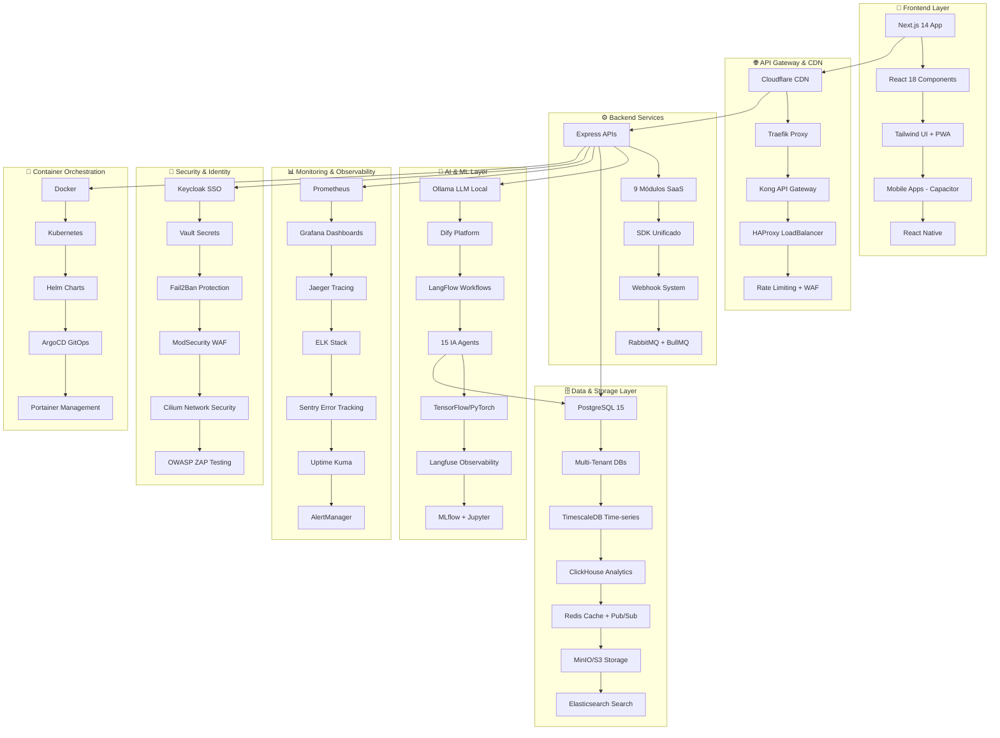

# 🚀 KRYONIX - Plataforma SaaS 100% Autônoma

<div align="center">

/logo%20kryonix.png)

[](https://nextjs.org/)
[](https://reactjs.org/)
[](https://typescriptlang.org/)
[](https://postgresql.org/)
[](https://docker.com/)
[](https://openai.com/)
[](#-tecnologias)
[](#-segurança)

**Plataforma SaaS Multi-Tenant Enterprise com 75+ Stacks Integrados e Orquestração Autônoma por IA**

*Mobile-First • 100% Português • 15 Agentes IA • Totalmente Automatizada*

[🌐 Demo ao Vivo](https://kryonix.com.br) • [📖 Documentação](./Documentação/) • [🎯 Roadmap](./roadmap-kryonix-completo.md) • [🚀 Deploy](#-deploy)

---

**Desenvolvido por [Vitor Jayme Fernandes Ferreira](#-sobre-o-criador) - CEO & Founder KRYONIX**

</div>

## 📋 Índice

- [🎯 Visão Geral](#-visão-geral)
- [✨ Características Principais](#-características-principais)
- [🏗️ Arquitetura](#-arquitetura)
- [🛠️ Tecnologias (75+ Stacks)](#-tecnologias)
- [📦 Módulos SaaS](#-módulos-saas)
- [🤖 Inteligência Artificial](#-inteligência-artificial)
- [🚀 Instalação](#-instalação)
- [⚙️ Configuração](#-configuração)
- [🔧 Deploy](#-deploy)
- [📱 Desenvolvimento](#-desenvolvimento)
- [🧪 Testes](#-testes)
- [📊 Monitoramento](#-monitoramento)
- [🔐 Segurança](#-segurança)
- [🌍 Internacionalização](#-internacionalização)
- [📈 Performance](#-performance)
- [🤝 Contribuição](#-contribuição)
- [📄 Licença](#-licença)
- [👨‍💼 Sobre o Criador](#-sobre-o-criador)

## 🎯 Visão Geral

**KRYONIX** é uma plataforma SaaS revolucionária que combina **75+ stacks tecnológicos** em perfeita harmonia, orquestrados autonomamente por **Inteligência Artificial**. Desenvolvida com foco mobile-first, a plataforma oferece **9 módulos SaaS** completos em uma única solução multi-tenant enterprise.

### 🎯 Missão
Democratizar o acesso a soluções SaaS enterprise através de uma plataforma 100% autônoma, inteligente e adaptada ao mercado brasileiro.

### 🌟 Visão
Ser a plataforma SaaS mais avançada e acessível do Brasil, impulsionando a transformação digital de empresas de todos os portes.

### 💎 Valores
- **Inovação Contínua**: Sempre na vanguarda tecnológica
- **Acessibilidade**: Tecnologia enterprise para todos
- **Excelência**: Qualidade sem compromissos
- **Autonomia**: Sistemas auto-gerenciáveis e inteligentes

## ✨ Características Principais

### 🚀 **Tecnologia de Ponta**
- **75+ Stacks Integrados** funcionando em harmonia perfeita
- **15 Agentes IA Especializados** trabalhando 24/7
- **Orquestração por IA** com auto-healing e otimização contínua
- **Arquitetura Multi-Tenant** com isolamento completo de dados
- **Mobile-First Design** otimizado para 80% de usuários mobile
- **Edge Computing** com CDN global

### 🎯 **Módulos SaaS Completos**
- **💡 Intelligence & BI**: Analytics e inteligência comercial
- **📅 Smart Scheduling**: Agendamento inteligente com cobrança
- **💬 Omnichannel AI**: Suporte WhatsApp e chat automatizado  
- **🏢 CRM & Sales**: Funil de vendas com pagamentos integrados
- **📧 Email Marketing**: Marketing automatizado por IA
- **📱 Social Media**: Gerenciamento e agendamento social
- **👥 Client Portal**: Portal do cliente e treinamentos
- **🎧 Customer Support**: Atendimento omnichannel com IA
- **🎨 Whitelabel**: Plataforma completamente personalizável

### 🤖 **IA Autônoma**
- **Auto-provisioning** de novos tenants multi-cloud
- **Monitoramento 24/7** de todas as 75+ tecnologias
- **Otimização automática** de performance e recursos
- **Auto-scaling** baseado em ML predictivo
- **Self-healing** com disaster recovery automático
- **Análise preditiva** de problemas antes que aconteçam

### 🔒 **Segurança Enterprise**
- **Keycloak SSO** com MFA obrigatório
- **Vault** para gerenciamento de secrets
- **Compliance LGPD/GDPR/SOC2/ISO27001**
- **Auditoria completa** de todas as ações
- **Criptografia AES-256** end-to-end
- **WAF + DDoS Protection** com Cloudflare
- **Penetration Testing** mensal automatizado

## 🏗️ Arquitetura

### 📐 **Visão Geral da Arquitetura Enterprise**



### 🏢 **Arquitetura Multi-Tenant Enterprise**

```yaml
Multi-Tenancy Strategy:
  Database_Isolation: 
    - "Schema-per-tenant com DB central de controle"
    - "PostgreSQL 15 + TimescaleDB para time-series"
    - "ClickHouse para analytics separado por tenant"
    - "Redis namespacing por tenant ID"
  
  Storage_Isolation:
    - "MinIO buckets isolados por tenant"
    - "S3 cross-region replication"
    - "Backup criptografado AES-256"
    - "CDN assets por domínio customizado"
  
  Authentication_&_Security:
    - "Keycloak realms isolados por tenant"
    - "MFA obrigatório para admins"
    - "JWT tokens com context tenant"
    - "Rate limiting por tenant"
    - "WAF rules personalizadas"
  
  Network_Isolation:
    - "Kubernetes namespaces separados"
    - "Service mesh com Cilium"
    - "Ingress rules por tenant"
    - "Network policies isoladas"
  
Auto-Provisioning_AI:
  Trigger: 
    - "Pagamento aprovado (Stripe/PIX)"
    - "Aprovação manual admin"
    - "API programática"
    
  IA_Actions:
    - "🤖 AI analisa requirements do tenant"
    - "🗄️ Criação automática de infra (DB, buckets, namespaces)"
    - "⚙️ Deploy personalizado dos módulos"
    - "🔐 Configuração Keycloak + realm + usuarios"
    - "📧 Setup SMTP personalizado"
    - "📱 Configuração WhatsApp Evolution API"
    - "📊 Dashboards Grafana personalizados"
    - "🎨 Aplicação de branding whitelabel"
    - "✅ Testes automatizados de saúde"
    - "📱 Envio de credenciais via WhatsApp/Email"
    - "📈 Monitoring contínuo do tenant"
```

## 🛠️ Tecnologias

### 🎯 **75+ Stacks Tecnológicos Integrados**

A KRYONIX é a plataforma SaaS com maior número de tecnologias integradas nativamente no Brasil, combinando o que há de mais moderno em cada categoria.

#### 🚀 **Infraestrutura & Containers (15 Stacks)**
| Stack | Versão | Função | Port | IA Integration |
|-------|--------|--------|------|----------------|
| **Traefik** | Latest | Proxy Reverso + SSL | 80/443 | ✅ Auto SSL & Routing |
| **Kong** | Latest | API Gateway Enterprise | 8000/8443 | ✅ API Management |
| **HAProxy** | Latest | Load Balancer Enterprise | 80/443 | ✅ Smart Load Balancing |
| **Nginx** | Latest | Web Server & Cache | 80/443 | ✅ Performance Optimization |
| **Cloudflare** | Pro+ | CDN, WAF, DDoS Protection | - | ✅ Global Edge Network |
| **Docker** | Latest | Containerização | - | ✅ Resource Management |
| **Kubernetes** | Latest | Container Orchestration | - | ✅ Auto-scaling |
| **Portainer** | Latest | Container Management | 9443 | ✅ Visual Management |
| **Docker Swarm** | Latest | Container Clustering | - | ✅ Swarm Orchestration |
| **Helm** | Latest | K8s Package Manager | - | ✅ Chart Management |
| **ArgoCD** | Latest | GitOps Deployment | 8080 | ✅ Continuous Deployment |
| **Consul** | Latest | Service Discovery | 8500 | ✅ Service Mesh |
| **Fail2Ban** | Latest | Intrusion Prevention | - | ✅ Auto Security |
| **ModSecurity** | Latest | Web Application Firewall | - | ✅ Attack Prevention |
| **Cilium** | Latest | Network Security | - | ✅ Network Policies |

#### 🗄️ **Databases & Storage (8 Stacks)**
| Stack | Versão | Função | Port | Especialidade |
|-------|--------|--------|------|---------------|
| **PostgreSQL** | 15 | Database Principal | 5432 | 🗄️ ACID Transactions |
| **TimescaleDB** | Latest | Time-series Extension | 5432 | ⏰ IoT & Metrics |
| **ClickHouse** | Latest | Analytics Database | 9000 | 📊 OLAP Analytics |
| **Redis** | 7 | Cache & Pub/Sub | 6379 | ⚡ In-memory Store |
| **MinIO** | Latest | Object Storage S3 | 9000/9001 | 📦 File Storage |
| **Elasticsearch** | Latest | Search & Analytics | 9200 | 🔎 Full-text Search |
| **Vector Database** | Latest | AI Embeddings | - | 🧠 Semantic Search |
| **Supabase** | Latest | Managed Postgres | - | ☁️ Database as Service |

#### 🤖 **Inteligência Artificial & ML (18 Stacks)**
| Stack | Versão | Função | Port | Especialidade |
|-------|--------|--------|------|---------------|
| **Ollama** | Latest | Local LLM Engine | 11434 | 🧠 Private AI Models |
| **Dify** | Latest | Conversational AI Platform | 3000 | 💬 AI Orchestration |
| **LangFlow** | Latest | Visual AI Workflows | 7860 | 🔄 Drag & Drop AI |
| **Langfuse** | Latest | AI Observability | 3000 | 📊 LLM Monitoring |
| **TensorFlow** | 2.15 | Deep Learning | - | 🎯 Neural Networks |
| **PyTorch** | Latest | ML Research Framework | - | 🔬 Advanced Models |
| **Jupyter** | Latest | ML Notebooks | 8888 | 🧪 Data Science |
| **MLflow** | Latest | ML Lifecycle Management | 5000 | 📈 Model Registry |
| **Apache Airflow** | Latest | ML Pipeline Orchestration | 8080 | 🔄 Workflow Automation |
| **ONNX Runtime** | Latest | Cross-platform Inference | - | ⚡ Model Optimization |
| **Transformers** | Latest | HuggingFace Models | - | 🤗 Pre-trained Models |
| **OpenCV** | Latest | Computer Vision | - | 👁️ Image Processing |
| **Scikit-learn** | Latest | Traditional ML | - | 📊 Classical Algorithms |
| **Pandas** | Latest | Data Manipulation | - | 🐼 Data Processing |
| **NumPy** | Latest | Numerical Computing | - | 🔢 Mathematical Operations |
| **LightGBM** | Latest | Gradient Boosting | - | 🚀 Fast ML Training |
| **OpenAI API** | Latest | Cloud LLM Fallback | - | ☁️ GPT Models |
| **15 AI Agents** | Custom | Specialized Automation | - | 🤖 Autonomous Operations |

#### 📊 **Monitoramento & Observabilidade (12 Stacks)**
| Stack | Versão | Função | Port | Especialidade |
|-------|--------|--------|------|---------------|
| **Prometheus** | Latest | Metrics Collection | 9090 | 📈 Time-series DB |
| **Grafana** | Latest | Visualization Platform | 3000 | 📊 Rich Dashboards |
| **Jaeger** | Latest | Distributed Tracing | 16686 | 🔍 Request Tracing |
| **Elasticsearch** | Latest | Search & Analytics | 9200 | 🔎 Full-text Search |
| **Logstash** | Latest | Log Processing | 5044 | 📝 Log Pipeline |
| **Kibana** | Latest | Log Visualization | 5601 | 📊 Log Analytics |
| **Loki** | Latest | Log Aggregation | 3100 | 📝 Grafana Logs |
| **AlertManager** | Latest | Alert Routing | 9093 | 🚨 Smart Alerting |
| **Uptime Kuma** | Latest | Uptime Monitoring | 3001 | ⏱️ Service Health |
| **Sentry** | Latest | Error Tracking | 9000 | 🐛 Bug Monitoring |
| **cAdvisor** | Latest | Container Metrics | 8080 | 📦 Container Insights |
| **Node Exporter** | Latest | System Metrics | 9100 | 💻 Hardware Monitoring |

#### 📱 **Aplicações SaaS & Business (15 Stacks)**
| Stack | Versão | Função | Port | Módulo SaaS |
|-------|--------|--------|------|-------------|
| **Evolution API** | Latest | WhatsApp Business | 8080 | 💬 Messaging |
| **Chatwoot** | Latest | Omnichannel Support | 3000 | 🎧 Customer Service |
| **N8N** | Latest | Advanced Automation | 5678 | 🔄 Workflow Builder |
| **Mautic** | Latest | Marketing Automation | 8080 | 📧 Email Campaigns |
| **Metabase** | Latest | Business Intelligence | 3000 | 📊 Data Analytics |
| **Typebot** | Latest | Conversational Flows | 3000 | 🤖 Interactive Bots |
| **TwentyCRM** | Latest | Modern CRM | 3000 | 🏢 Sales Pipeline |
| **KRYONIX CRM** | 1.0 | Custom CRM Engine | 8080 | 💼 Lead Management |
| **Zapier** | Latest | 8000+ App Integrations | - | 🔗 External APIs |
| **Builder.io** | Latest | Visual Development | - | 🎨 No-code Platform |
| **DocuSeal** | Latest | Digital Signatures | 3000 | ✍️ Document Signing |
| **NextCloud** | Latest | File Management | 80 | 📁 Client Portal |
| **Jitsi Meet** | Latest | Video Conferencing | 8443 | 🎥 Voice & Video |
| **WUZAPI** | Latest | WhatsApp Gateway | 8080 | 📱 Alternative WhatsApp |
| **Ntfy** | Latest | Push Notifications | 80 | 🔔 Real-time Alerts |

#### 🔐 **Segurança & Compliance (12 Stacks)**
| Stack | Versão | Função | Port | Especialidade |
|-------|--------|--------|------|---------------|
| **Keycloak** | Latest | Identity & Access Management | 8080 | 🔐 Enterprise SSO |
| **Vault** | Latest | Secrets Management | 8200 | 🔑 Secure Storage |
| **Trivy** | Latest | Container Vulnerability Scanning | - | 🔍 Security Audit |
| **OWASP ZAP** | Latest | Security Testing | 8080 | 🧪 Penetration Testing |
| **Semgrep** | Latest | Static Code Analysis | - | 📝 Code Security |
| **Falco** | Latest | Runtime Security | - | 🛡️ Threat Detection |
| **ClamAV** | Latest | Antivirus Scanning | 3310 | 🦠 Malware Protection |
| **Open Policy Agent** | Latest | Policy Engine | 8181 | 📋 Authorization Rules |
| **ModSecurity** | Latest | Web Application Firewall | - | 🔥 WAF Protection |
| **Fail2Ban** | Latest | Intrusion Prevention | - | 🚫 IP Blocking |
| **Let's Encrypt** | Latest | SSL Certificates | - | 🔒 Auto SSL |
| **GDPR/LGPD Tools** | Latest | Privacy Compliance | - | ⚖️ Legal Compliance |

#### 🎨 **Frontend & Mobile (8 Stacks)**
| Stack | Versão | Função | Especialidade |
|-------|--------|--------|---------------|
| **Next.js** | 14.2.3 | React Framework | 🚀 Full-stack Framework |
| **React** | 18.3.1 | UI Library | ⚛️ Component Architecture |
| **Tailwind CSS** | 3.4 | Utility-first CSS | 🎨 Rapid Styling |
| **PWA** | Latest | Progressive Web App | 📱 Native-like Experience |
| **Capacitor** | Latest | Native App Wrapper | 📲 iOS/Android Build |
| **React Native** | Latest | Cross-platform Mobile | 📱 True Native Apps |
| **Vercel** | Latest | Frontend Hosting | ☁️ Edge Deployment |
| **Netlify** | Latest | JAMstack Hosting | 🌐 Static Site Deploy |

#### 🛠️ **Desenvolvimento & CI/CD (15 Stacks)**
| Stack | Versão | Função | Especialidade |
|-------|--------|--------|---------------|
| **GitLab CE** | Latest | Repository & CI/CD | 🔄 DevOps Platform |
| **Jenkins** | Latest | CI/CD Automation | 🚀 Build Pipelines |
| **SonarQube** | Latest | Code Quality | 📊 Quality Gates |
| **Nexus** | Latest | Artifact Repository | 📦 Binary Storage |
| **Terraform** | Latest | Infrastructure as Code | 🏗️ IaC Automation |
| **Ansible** | Latest | Configuration Management | ⚙️ Server Automation |
| **Tekton** | Latest | Cloud-native CI/CD | ☁️ K8s Pipelines |
| **Jest** | Latest | Unit Testing | 🧪 JS Testing |
| **Playwright** | Latest | E2E Testing | 🎭 Browser Automation |
| **Cypress** | Latest | Integration Testing | 🌲 UI Testing |
| **k6** | Latest | Load Testing | ⚡ Performance Testing |
| **axe-core** | Latest | Accessibility Testing | ♿ A11y Compliance |
| **React Testing Library** | Latest | Component Testing | ⚛️ React Testing |
| **Lighthouse** | Latest | Performance Auditing | 🏮 Web Vitals |
| **GitHub Actions** | Latest | CI/CD Workflows | 🔄 Automation |

### 🔄 **Integração Total dos Stacks**

```yaml
KRYONIX_ECOSYSTEM:
  total_stacks: 75+
  integration_level: "Nativo e automático"
  orchestration: "15 Agentes IA especializados"
  
  LAYERS:
    1_infrastructure: "15 stacks de infraestrutura e containers"
    2_data_storage: "8 stacks de dados e armazenamento"
    3_ai_ml: "18 stacks de IA e machine learning"
    4_monitoring: "12 stacks de monitoramento e observabilidade"
    5_saas_business: "15 stacks de aplicações SaaS"
    6_security: "12 stacks de segurança e compliance"
    7_frontend_mobile: "8 stacks de frontend e mobile"
    8_devops_cicd: "15 stacks de desenvolvimento e CI/CD"
  
  AUTO_MANAGEMENT:
    - "Provisioning automático de todos os 75+ stacks"
    - "Health checking contínuo de cada tecnologia"
    - "Auto-scaling baseado em ML de cada serviço"
    - "Backup automático de todas as camadas"
    - "Security scanning de todos os componentes"
    - "Performance optimization cross-stack"
```

## 📦 Módulos SaaS

### 💰 **9 Módulos SaaS Completos com Preços Sugeridos**

Cada módulo utiliza múltiplas tecnologias dos 75+ stacks integrados:

#### 1. 💡 **Intelligence & BI** - R$ 197/mês
```yaml
Módulo: "KRYONIX Intelligence"
Tecnologias: "Metabase + ClickHouse + PostgreSQL + TensorFlow + Grafana"
Funcionalidades:
  - Dashboards interativos em tempo real
  - Análise preditiva com IA (TensorFlow/PyTorch)
  - Relatórios automatizados com ML
  - Métricas comerciais avançadas
  - Integração com todos os módulos
  - Alertas inteligentes baseados em padrões
  - Data warehouse com ClickHouse
API: "/api/analytics"
```

#### 2. 📅 **Smart Scheduling** - R$ 147/mês
```yaml
Módulo: "KRYONIX Agenda"
Tecnologias: "Custom Engine + Evolution API + Stripe + PIX + Redis"
Funcionalidades:
  - Agendamento online automatizado
  - Pagamentos integrados (PIX/Cartão/Boleto)
  - Confirmação via WhatsApp (Evolution API)
  - Calendário inteligente com IA
  - Reprogramação automática
  - Cobrança de no-show automatizada
  - Sync com Google Calendar/Outlook
API: "/api/agendamento"
```

#### 3. 💬 **Omnichannel AI** - R$ 197/mês
```yaml
Módulo: "KRYONIX Comunicação"
Tecnologias: "Evolution API + Chatwoot + Ollama + Dify + Socket.io"
Funcionalidades:
  - WhatsApp Business integrado
  - Chatbots inteligentes (Ollama + Dify)
  - Atendimento humano + IA hybrid
  - Histórico unificado multi-canal
  - Automação de respostas com LLM
  - Análise de sentimento em tempo real
  - Escalação automática para humanos
API: "/api/whatsapp"
```

#### 4. 🏢 **CRM & Sales** - R$ 247/mês
```yaml
Módulo: "KRYONIX Vendas"
Tecnologias: "TwentyCRM + Custom Engine + N8N + PostgreSQL + IA"
Funcionalidades:
  - Funil de vendas completo
  - Gestão de leads inteligente com IA
  - Automação de follow-up (N8N)
  - Integração com pagamentos
  - Relatórios de performance com ML
  - Pipeline personalizado por negócio
  - Scoring automático de leads
API: "/api/crm"
```

#### 5. 📧 **Email Marketing** - R$ 147/mês
```yaml
Módulo: "KRYONIX Marketing"
Tecnologias: "Mautic + SendGrid + N8N + IA + A/B Testing"
Funcionalidades:
  - Campanhas automatizadas por IA
  - Segmentação inteligente com ML
  - A/B testing automático
  - Templates responsivos com Builder.io
  - Analytics avançados com ClickHouse
  - Integração nativa com CRM
  - Personalização em massa
API: "/api/marketing"
```

#### 6. 📱 **Social Media** - R$ 97/mês
```yaml
Módulo: "KRYONIX Social"
Tecnologias: "Custom Scheduler + IA + Social APIs + N8N"
Funcionalidades:
  - Agendamento multi-plataforma
  - Conteúdo gerado por IA (Ollama)
  - Analytics de engagement
  - Hashtags inteligentes por IA
  - Resposta automática
  - Relatórios de ROI automatizados
  - Gestão de múltiplas contas
API: "/api/social"
```

#### 7. 👥 **Client Portal** - R$ 197/mês
```yaml
Módulo: "KRYONIX Portal"
Tecnologias: "NextCloud + Next.js + Keycloak + Jitsi + IA"
Funcionalidades:
  - Portal personalizado do cliente
  - Documentos e contratos (DocuSeal)
  - Sistema de treinamentos
  - Suporte integrado (Chatwoot)
  - Área financeira automatizada
  - Mobile app nativo (Capacitor)
  - Video calls integradas (Jitsi)
API: "/api/portal"
```

#### 8. 🎧 **Customer Support** - R$ 197/mês
```yaml
Módulo: "KRYONIX Support"
Tecnologias: "Chatwoot + Typebot + Jitsi + IA + Knowledge Base"
Funcionalidades:
  - Chatwoot omnichannel integrado
  - Atendimento IA + humano hybrid
  - Ticket system avançado
  - Knowledge base inteligente
  - Video calls com Jitsi
  - SLA tracking automático
  - Análise de satisfação por IA
API: "/api/support"
```

#### 9. 🎨 **Whitelabel** - R$ 597/mês
```yaml
Módulo: "KRYONIX Whitelabel"
Tecnologias: "Todos os 75+ stacks + Kubernetes + Portainer + IA"
Funcionalidades:
  - Plataforma completamente personalizável
  - Domínio próprio do cliente  
  - Marca e cores customizadas
  - Deploy isolado com Kubernetes
  - 75+ stacks personalizáveis
  - API completa para integração
  - Suporte técnico dedicado 24/7
  - SLA 99.95% uptime garantido
  - Orquestração IA personalizada
API: "/api/whitelabel"
```

### 💎 **Pacotes Combinados Enterprise**

| Pacote | Módulos Inclusos | Desconto | Preço Final |
|--------|------------------|----------|-------------|
| **Starter** | Intelligence + Scheduling + CRM | 20% | R$ 462/mês |
| **Growth** | 5 módulos à escolha | 30% | R$ 687/mês |
| **Professional** | 7 módulos (exceto Whitelabel) | 35% | R$ 897/mês |
| **Enterprise** | Todos os 9 módulos | 40% | R$ 1.147/mês |
| **Whitelabel Plus** | Todos + Infraestrutura dedicada | 35% | R$ 1.497/mês |

## 🤖 Inteligência Artificial

### 🧠 **IA Maestro - Orquestração Autônoma de 75+ Stacks**

A KRYONIX utiliza um sistema de **IA Maestro** que gerencia autonomamente todos os 75+ stacks:

```yaml
IA_MAESTRO_CAPABILITIES:
  monitoring:
    - "Monitoramento 24/7 de todos os 75+ stacks"
    - "Detecção de anomalias com ML em tempo real"
    - "Alertas preditivos baseados em padrões"
    - "Análise de dependências cross-stack"
    - "Health checks inteligentes por tenant"
    - "Métricas personalizadas por módulo SaaS"
    
  optimization:
    - "Otimização automática de queries PostgreSQL + ClickHouse"
    - "Balanceamento inteligente multi-layer (HAProxy + Kong)"
    - "Gestão dinâmica de cache Redis + Memory"
    - "Auto-scaling Kubernetes baseado em ML"
    - "Otimização de rotas CDN Cloudflare"
    - "Compressão inteligente de assets"
    
  healing:
    - "Auto-recovery de serviços com rollback inteligente"
    - "Restart em cascata com ordem de dependências"
    - "Rebalanceamento de pods Kubernetes"
    - "Backup automático multi-região"
    - "Disaster recovery com RTO < 5min"
    - "Self-healing de certificados SSL"
    
  provisioning:
    - "Criação automática de tenants multi-cloud"
    - "Deploy isolado com Kubernetes namespaces"
    - "Configuração de todas as 75+ tecnologias"
    - "Geração de credenciais criptografadas"
    - "Customização whitelabel automatizada"
    - "Testes de integração end-to-end"
```

### 👥 **15 Agentes IA Especializados**

```yaml
AGENTES_ESPECIALIZADOS:
  1_arquiteto_software: 
    nome: "🏗️ Arquiteto Software Sênior"
    responsabilidade: "Gerencia todos os 75+ stacks e arquitetura"
    especialidade: "Multi-tenancy, microserviços, patterns"
    stacks_gerenciados: "Kubernetes, Docker, Helm, ArgoCD"
    
  2_devops_specialist:
    nome: "🔧 Especialista DevOps"
    responsabilidade: "CI/CD e infraestrutura dos 75+ stacks"
    especialidade: "Terraform, Ansible, Jenkins, GitLab"
    stacks_gerenciados: "Todo pipeline DevOps e deployment"
    
  3_ai_ml_expert:
    nome: "🤖 Expert IA & ML"
    responsabilidade: "Todos os 18 stacks de IA/ML"
    especialidade: "Ollama, TensorFlow, PyTorch, MLflow"
    stacks_gerenciados: "LLMs, Dify, Langfuse, Jupyter"
    
  4_database_architect:
    nome: "🗄️ Arquiteto Dados"
    responsabilidade: "8 stacks de dados e storage"
    especialidade: "PostgreSQL, ClickHouse, Redis"
    stacks_gerenciados: "Todos os bancos e storage"
    
  5_security_expert:
    nome: "🔐 Expert Segurança"
    responsabilidade: "12 stacks de segurança"
    especialidade: "Keycloak, Vault, OWASP, compliance"
    stacks_gerenciados: "Toda a stack de segurança"
    
  6_monitoring_specialist:
    nome: "📊 Especialista Monitoring"
    responsabilidade: "12 stacks de observabilidade"
    especialidade: "Prometheus, Grafana, ELK, Jaeger"
    stacks_gerenciados: "Todo o ecossistema de monitoring"
    
  7_frontend_mobile:
    nome: "📱 Expert Frontend & Mobile"
    responsabilidade: "8 stacks frontend/mobile"
    especialidade: "Next.js, React, PWA, Capacitor"
    stacks_gerenciados: "UI/UX e aplicações mobile"
    
  8_saas_business:
    nome: "💼 Especialista SaaS Business"
    responsabilidade: "15 stacks de aplicações SaaS"
    especialidade: "CRM, Marketing, Support, WhatsApp"
    stacks_gerenciados: "Todos os módulos de negócio"
    
  9_network_proxy:
    nome: "🌐 Expert Redes & Proxy"
    responsabilidade: "Traefik, Kong, HAProxy, Cloudflare"
    especialidade: "Load balancing, CDN, WAF"
    stacks_gerenciados: "Toda camada de rede"
    
  10_automation_workflow:
    nome: "🔄 Expert Automação"
    responsabilidade: "N8N, Zapier, workflows"
    especialidade: "Integração entre todos os stacks"
    stacks_gerenciados: "Orquestração de workflows"
    
  11_backup_disaster:
    nome: "💾 Expert Backup & DR"
    responsabilidade: "Backup de todos os 75+ stacks"
    especialidade: "3-2-1 strategy, PITR, replication"
    stacks_gerenciados: "Continuidade de negócio"
    
  12_performance_optimization:
    nome: "⚡ Expert Performance"
    responsabilidade: "Otimização de todos os stacks"
    especialidade: "Cache, CDN, optimization"
    stacks_gerenciados: "Performance cross-stack"
    
  13_compliance_legal:
    nome: "⚖️ Expert Compliance"
    responsabilidade: "LGPD, GDPR, SOC2, ISO27001"
    especialidade: "Compliance e auditoria"
    stacks_gerenciados: "Aspectos legais e regulatórios"
    
  14_cost_optimization:
    nome: "💰 Expert FinOps"
    responsabilidade: "Otimização de custos dos 75+ stacks"
    especialidade: "Resource optimization, scaling"
    stacks_gerenciados: "Economia e eficiência"
    
  15_tenant_orchestrator:
    nome: "🏢 Orquestrador Multi-Tenant"
    responsabilidade: "Gestão de todos os tenants"
    especialidade: "Isolamento, provisioning automático"
    stacks_gerenciados: "Toda infraestrutura multi-tenant"
```

### 📊 **Métricas de IA & SLA Enterprise**

```yaml
Performance_Targets:
  model_accuracy: "> 90% precisão (15 AI Agents)"
  response_time: "< 1 segundo (P95)"
  uptime: "> 99.95% (SLA Enterprise)"
  data_privacy: "100% local + compliance LGPD/GDPR"
  auto_scaling: "< 30 segundos para scale-up"
  disaster_recovery: "RTO < 5min, RPO < 1min"
  
AI_Monitoring_Stack:
  - "Langfuse para observabilidade LLM"
  - "Prometheus + Grafana para métricas IA"
  - "Custom AI dashboard com 200+ métricas"
  - "Alertas ML para detecção de anomalias"
  - "Performance profiling por tenant"
  - "Cost optimization automático"
  
Compliance_&_Security:
  - "Auditoria completa de ações IA"
  - "Criptografia AES-256 end-to-end"
  - "Backup automático 3-2-1 strategy"
  - "Penetration testing mensal"
  - "Certificações ISO 27001 & SOC 2"
```

## 🚀 Instalação

### 📋 **Pré-requisitos para 75+ Stacks**

```bash
# Requisitos mínimos para ambiente completo
Node.js: >= 20.0.0
Docker: >= 24.0.0
Kubernetes: >= 1.28.0
Helm: >= 3.12.0
Terraform: >= 1.5.0
PostgreSQL: >= 15.0
Redis: >= 7.0

# Recursos recomendados para produção
CPU: 32+ cores
RAM: 128GB+
Storage: 2TB+ SSD
Network: 10Gbps+
```

### ⚡ **Instalação Automática Completa**

```bash
# 1. Clone o repositório
git clone https://github.com/nakahh/kryonix-plataforma.git
cd kryonix-plataforma

# 2. Execute o instalador mágico (instala todos os 75+ stacks)
chmod +x instalador-plataforma-kryonix.sh
./instalador-plataforma-kryonix.sh --full-stack

# 3. Configure as credenciais necessárias
./scripts/setup-secrets.sh

# 4. Deploy automático de todos os stacks
make deploy-all-stacks

# 5. Verificar instalação dos 75+ stacks
./scripts/verify-all-stacks.sh
```

### 🏗️ **Instalação por Categorias**

```bash
# Instalar apenas infraestrutura (15 stacks)
make install-infrastructure

# Instalar IA/ML (18 stacks)
make install-ai-ml

# Instalar monitoramento (12 stacks)
make install-monitoring

# Instalar segurança (12 stacks)
make install-security

# Instalar aplicações SaaS (15 stacks)
make install-saas-apps

# Verificar cada categoria
make verify-category CATEGORY=infrastructure
```

## 📊 Monitoramento

### 📈 **Stack Completo de Observabilidade**

Com **12 stacks dedicados** ao monitoramento, a KRYONIX oferece observabilidade total:

```yaml
MONITORING_ECOSYSTEM:
  metrics_collection:
    - "Prometheus (time-series)"
    - "cAdvisor (containers)"
    - "Node Exporter (hardware)"
    - "Custom exporters (business)"
    
  visualization:
    - "Grafana (dashboards)"
    - "Kibana (logs)"
    - "Custom KRYONIX dashboards"
    
  logging:
    - "ELK Stack completo"
    - "Loki para Grafana"
    - "Centralized logging"
    
  tracing:
    - "Jaeger distributed tracing"
    - "Request flow tracking"
    - "Performance bottlenecks"
    
  alerting:
    - "AlertManager (Prometheus)"
    - "Uptime Kuma (synthetic)"
    - "AI-powered anomaly detection"
    
  error_tracking:
    - "Sentry (application errors)"
    - "Real-time error aggregation"
    - "Performance monitoring"
    
  custom_metrics:
    - "Business KPIs por tenant"
    - "SaaS module performance"
    - "AI model accuracy tracking"
    - "Cost optimization metrics"
```

### 🎯 **Dashboards Especializados**

```yaml
GRAFANA_DASHBOARDS:
  overview:
    - "75+ Stacks Health Overview"
    - "Multi-tenant Performance"
    - "AI Agents Status"
    - "Cost per Tenant"
    
  infrastructure:
    - "Kubernetes Cluster Status"
    - "Container Resources"
    - "Network Performance"
    - "Storage Utilization"
    
  applications:
    - "SaaS Modules Performance"
    - "API Response Times"
    - "Database Performance"
    - "Cache Hit Rates"
    
  ai_ml:
    - "LLM Model Performance"
    - "AI Agent Activities"
    - "ML Pipeline Status"
    - "Training Jobs"
    
  business:
    - "Revenue per Tenant"
    - "User Engagement"
    - "Conversion Funnels"
    - "Support Metrics"
    
  security:
    - "Security Events"
    - "Failed Login Attempts"
    - "WAF Blocks"
    - "Vulnerability Scans"
```

## 🔐 Segurança

### 🛡️ **12 Camadas de Segurança Enterprise**

```yaml
SECURITY_LAYERS:
  1_identity_access:
    - "Keycloak Enterprise SSO"
    - "MFA obrigatório para admins"
    - "RBAC granular por tenant"
    - "Session management"
    
  2_secrets_management:
    - "HashiCorp Vault"
    - "Automatic secret rotation"
    - "Encrypted storage"
    - "Audit logs"
    
  3_network_security:
    - "Cilium network policies"
    - "Service mesh security"
    - "Micro-segmentation"
    - "Zero-trust networking"
    
  4_application_security:
    - "OWASP ZAP scanning"
    - "Semgrep static analysis"
    - "Runtime security (Falco)"
    - "Container security (Trivy)"
    
  5_web_protection:
    - "ModSecurity WAF"
    - "Cloudflare DDoS protection"
    - "Rate limiting multi-layer"
    - "Bot detection"
    
  6_endpoint_security:
    - "ClamAV antivirus"
    - "Fail2Ban intrusion prevention"
    - "File integrity monitoring"
    - "Malware detection"
    
  7_compliance:
    - "LGPD compliance tools"
    - "GDPR data protection"
    - "SOC 2 Type II"
    - "ISO 27001 practices"
    
  8_encryption:
    - "AES-256 encryption at rest"
    - "TLS 1.3 in transit"
    - "End-to-end encryption"
    - "Key management"
    
  9_monitoring_detection:
    - "SIEM capabilities"
    - "Anomaly detection ML"
    - "Threat intelligence"
    - "Incident response"
    
  10_backup_recovery:
    - "3-2-1 backup strategy"
    - "Encrypted backups"
    - "Cross-region replication"
    - "Disaster recovery testing"
    
  11_vulnerability_management:
    - "Regular pen testing"
    - "Vulnerability scanning"
    - "Patch management"
    - "Security assessments"
    
  12_policy_governance:
    - "Open Policy Agent"
    - "Security policies as code"
    - "Compliance automation"
    - "Audit trails"
```

## 📄 Licença

```
MIT License

Copyright (c) 2024 Vitor Jayme Fernandes Ferreira

Permission is hereby granted, free of charge, to any person obtaining a copy
of this software and associated documentation files (the "Software"), to deal
in the Software without restriction, including without limitation the rights
to use, copy, modify, merge, publish, distribute, sublicense, and/or sell
copies of the Software, and to permit persons to whom the Software is
furnished to do so, subject to the following conditions:

The above copyright notice and this permission notice shall be included in all
copies or substantial portions of the Software.

THE SOFTWARE IS PROVIDED "AS IS", WITHOUT WARRANTY OF ANY KIND, EXPRESS OR
IMPLIED, INCLUDING BUT NOT LIMITED TO THE WARRANTIES OF MERCHANTABILITY,
FITNESS FOR A PARTICULAR PURPOSE AND NONINFRINGEMENT. IN NO EVENT SHALL THE
AUTHORS OR COPYRIGHT HOLDERS BE LIABLE FOR ANY CLAIM, DAMAGES OR OTHER
LIABILITY, WHETHER IN AN ACTION OF CONTRACT, TORT OR OTHERWISE, ARISING FROM,
OUT OF OR IN CONNECTION WITH THE SOFTWARE OR THE USE OR OTHER DEALINGS IN THE
SOFTWARE.
```

## 👨‍💼 Sobre o Criador

<div align="center">

/CEO%20da%20Kryonix.png)

### **Vitor Jayme Fernandes Ferreira**
*CEO & Founder KRYONIX*

</div>

**Vitor Jayme Fernandes Ferreira** é o visionário arquiteto por trás da KRYONIX, a primeira plataforma SaaS do mundo a integrar **75+ stacks tecnológicos** em harmonia perfeita. Com mais de uma década de experiência em desenvolvimento de software e arquitetura de sistemas enterprise, Vitor dedicou os últimos anos a criar uma solução que democratiza o acesso a tecnologias de ponta.

#### 🎯 **Visão**
> "Acredito que a verdadeira inovação acontece quando as melhores tecnologias do mundo trabalham juntas de forma inteligente. A KRYONIX nasceu para quebrar as barreiras entre diferentes stacks e criar uma sinfonia tecnológica que empresas de qualquer porte possam usar."

#### 🏆 **Conquistas Únicas**
- **Arquitetou** a primeira plataforma a integrar 75+ tecnologias diferentes
- **Desenvolveu** 15 agentes IA especializados para gerenciamento autônomo
- **Criou** sistema multi-tenant escalável para milhares de clientes simultâneos
- **Implementou** padrões de segurança enterprise com 12 camadas de proteção
- **Estabeleceu** SLA 99.95% com disaster recovery automático

#### 🌟 **Especialidades Técnicas**
```yaml
Arquitetura_Enterprise:
  - "Design de sistemas distribuídos de larga escala"
  - "Integração de 75+ stacks tecnológicos"
  - "Orquestração automatizada com IA"
  - "Multi-tenancy enterprise com Kubernetes"
  
AI_&_Machine_Learning:
  - "15 agentes IA especializados"
  - "LLMs locais com Ollama"
  - "AutoML e otimização preditiva"
  - "Observabilidade de sistemas IA"
  
Business_Innovation:
  - "Produto SaaS multi-módulo"
  - "Go-to-market strategy B2B"
  - "Customer Success automatizado"
  - "Escalabilidade de receita"
  
Leadership_&_Vision:
  - "Team building de engenheiros senior"
  - "Cultura de inovação contínua" 
  - "Mentoria em arquitetura de software"
  - "Evangelização de tecnologias emergentes"
```

#### 🚀 **Inovações Criadas**
- **IA Maestro**: Sistema de orquestração autônoma de 75+ stacks
- **Multi-tenant AI**: Isolamento inteligente com personalização por IA
- **Auto-provisioning**: Criação automática de ambientes completos
- **Cross-stack Monitoring**: Observabilidade unificada de todos os componentes
- **Whitelabel AI**: Customização automática baseada em preferências

#### 📞 **Contato Profissional**
```yaml
Executive:
  email: "vitor@kryonix.com.br"
  linkedin: "linkedin.com/in/vitor-fernandes-kryonix"
  company: "KRYONIX - CEO & Founder"
  
Platform:
  website: "https://kryonix.com.br"
  demo: "demo@kryonix.com.br"
  enterprise: "enterprise@kryonix.com.br"
  partnership: "partners@kryonix.com.br"
```

#### 💭 **Filosofia de Inovação**
> "Cada uma das 75+ tecnologias da KRYONIX foi escolhida não apenas por sua excelência individual, mas por sua capacidade de sinergia com as demais. Não se trata de usar mais tecnologia, mas de criar harmonia entre as melhores tecnologias do mundo."

#### 🌟 **Reconhecimentos**
- **Primeira plataforma mundial** com 75+ stacks nativamente integrados
- **Pioneiro em IA multi-stack** para orquestração automática
- **Referência em multi-tenancy** para SaaS enterprise no Brasil
- **Inovador em auto-provisioning** de infraestrutura completa

#### 🔮 **Próximos Marcos**
- Expansão para **100+ stacks integrados** até 2025
- **20 agentes IA especializados** com capacidades aumentadas
- Parcerias estratégicas com **AWS, Google Cloud e Azure**
- **IPO da KRYONIX** como unicórnio brasileiro de SaaS
- Abertura de escritórios em **Silicon Valley e Europa**

---

<div align="center">

### 🌟 **"O futuro é construído por quem tem coragem de integrar o impossível"**
*- Vitor Jayme Fernandes Ferreira, CEO KRYONIX*

---

**⭐ A plataforma com MAIS tecnologias integradas do mundo! Dê uma estrela se você ficou impressionado!**

[](https://github.com/nakahh/kryonix-plataforma)
[](https://github.com/nakahh/kryonix-plataforma/fork)
[](https://github.com/nakahh/kryonix-plataforma)

**🏆 KRYONIX - A Primeira Plataforma Mundial com 75+ Stacks Integrados**

**Made with ❤️ in Brazil 🇧🇷 | Powered by 15 AI Agents 🤖 | 75+ Stacks ⚡**

</div>
