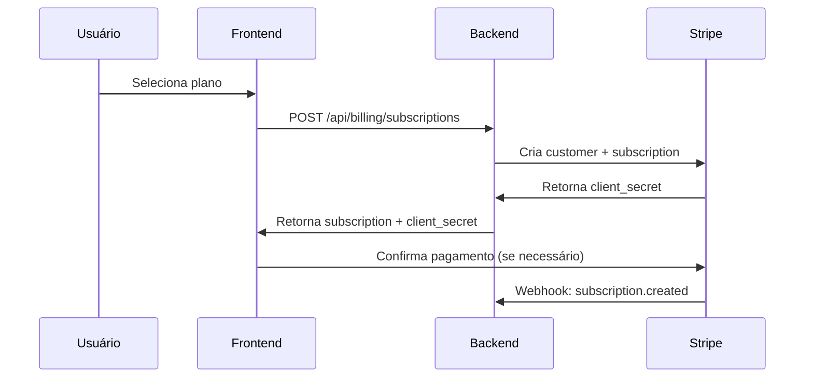
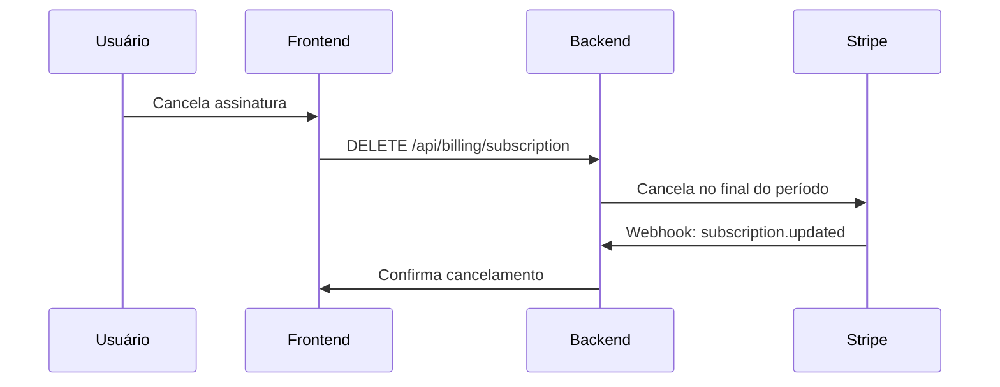

# Módulo 14: Sistema de Planos e Cobrança - KRYONIX

## 📋 Visão Geral

O **Módulo 14** implementa um sistema completo de cobrança e gerenciamento de planos para a plataforma KRYONIX, utilizando o Stripe como processador de pagamentos. Este módulo oferece funcionalidades avançadas de:

- ✅ Gestão de planos e assinaturas
- ✅ Integração completa com Stripe
- ✅ Controle de uso e limites
- ✅ Portal de cobrança self-service
- ✅ Webhooks para sincronização automática
- ✅ Interface de usuário moderna e responsiva

## 🏗️ Arquitetura Implementada

### Backend (Express.js + TypeScript)

```
server/
├── services/billing.ts          # Serviço principal de cobrança
├── routes/billing.ts            # Rotas da API de billing
└── index.ts                     # Configuração das rotas

shared/
└── billing.ts                   # Tipos TypeScript compartilhados
```

### Frontend (React + TypeScript)

```
client/
└── pages/Billing.tsx            # Interface de gerenciamento de planos
```

### Configuração

```
scripts/
└── setup-stripe.js              # Script de configuração do Stripe

docs/
└── module-14-billing-system.md  # Esta documentação
```

## 💳 Planos Disponíveis

### 🟢 Starter - R$ 29,90/mês

- 1 instância WhatsApp
- 1.000 mensagens/mês
- 5 regras de automação
- 2 membros da equipe
- 3 fluxos de chatbot
- 10.000 chamadas API/mês
- 5GB armazenamento
- Backup semanal
- 7 dias grátis

### 🔵 Professional - R$ 89,90/mês (Mais Popular)

- 5 instâncias WhatsApp
- 10.000 mensagens/mês
- 25 regras de automação
- 10 membros da equipe
- 15 fluxos de chatbot
- 100.000 chamadas API/mês
- 50GB armazenamento
- Integrações personalizadas
- Suporte prioritário
- Analytics avançado
- Domínio personalizado
- Backup diário
- 14 dias grátis

### 🟣 Enterprise - R$ 299,90/mês

- Recursos ilimitados
- 500GB armazenamento
- White label completo
- Suporte 24/7
- Manager dedicado
- Backup em tempo real
- 30 dias grátis

## 🔧 Configuração e Setup

### 1. Variáveis de Ambiente

Crie um arquivo `.env` baseado no `.env.example`:

```env
# Stripe Configuration
STRIPE_SECRET_KEY=sk_test_...
STRIPE_PUBLISHABLE_KEY=pk_test_...
STRIPE_WEBHOOK_SECRET=whsec_...

# Stripe Product and Price IDs
STRIPE_STARTER_PRODUCT_ID=prod_...
STRIPE_STARTER_PRICE_ID=price_...
STRIPE_PROFESSIONAL_PRODUCT_ID=prod_...
STRIPE_PROFESSIONAL_PRICE_ID=price_...
STRIPE_ENTERPRISE_PRODUCT_ID=prod_...
STRIPE_ENTERPRISE_PRICE_ID=price_...
```

### 2. Configuração Automática do Stripe

Execute o script de setup para criar produtos e preços automaticamente:

```bash
# Instalar dependências se necessário
npm install

# Executar script de configuração
node scripts/setup-stripe.js
```

O script irá:

- Criar produtos no Stripe para cada plano
- Configurar preços mensais e períodos de teste
- Gerar webhook endpoint
- Fornecer as variáveis de ambiente necessárias

### 3. Configuração Manual do Stripe (Alternativa)

Se preferir configurar manualmente:

1. **Acesse o Stripe Dashboard**
2. **Crie os Produtos:**

   - KRYONIX Starter
   - KRYONIX Professional
   - KRYONIX Enterprise

3. **Configure os Preços:**

   - Moeda: BRL (Real Brasileiro)
   - Cobrança: Recorrente mensal
   - Períodos de teste conforme cada plano

4. **Configure Webhooks:**
   - URL: `https://seu-dominio.com/api/billing/webhook`
   - Eventos: `customer.subscription.*`, `invoice.payment_*`

## 📡 API Endpoints

### Planos

```
GET    /api/billing/plans           # Listar planos disponíveis
GET    /api/billing/plans/:planId   # Obter detalhes de um plano
```

### Assinaturas

```
POST   /api/billing/subscriptions  # Criar nova assinatura
GET    /api/billing/subscription   # Obter assinatura atual
PUT    /api/billing/subscription   # Atualizar assinatura
DELETE /api/billing/subscription   # Cancelar assinatura
```

### Uso e Limites

```
GET    /api/billing/usage          # Obter dados de uso atual
PUT    /api/billing/usage          # Atualizar métricas de uso
```

### Métodos de Pagamento

```
POST   /api/billing/payment-methods # Adicionar método de pagamento
```

### Portal de Cobrança

```
POST   /api/billing/portal         # Criar sessão do portal
```

### Webhooks

```
POST   /api/billing/webhook        # Receber eventos do Stripe
```

### Saúde do Sistema

```
GET    /api/billing/health         # Verificar status do sistema
```

## 🔐 Autenticação

O sistema utiliza um header `x-user-id` para identificação do usuário:

```javascript
fetch("/api/billing/subscription", {
  headers: {
    "x-user-id": "user-123",
    "Content-Type": "application/json",
  },
});
```

**Nota:** Em produção, substitua por autenticação JWT/OAuth2.

## 📊 Controle de Uso

O sistema monitora automaticamente:

- **WhatsApp Instâncias:** Número de instâncias ativas
- **Mensagens:** Quantidade enviada por mês
- **Automações:** Regras de automação em uso
- **Equipe:** Membros ativos da equipe
- **Chatbots:** Fluxos de chatbot ativos
- **API Calls:** Chamadas à API por mês
- **Armazenamento:** Espaço utilizado em GB

### Alertas de Limite

- ⚠️ **75% do limite:** Aviso amarelo
- 🚨 **90% do limite:** Aviso vermelho
- 🚫 **100% do limite:** Bloqueio de recursos

## 🎨 Interface de Usuário

### Páginas Implementadas

1. **Planos Disponíveis** (`/billing`)

   - Grid responsivo de planos
   - Badges de "Mais Popular"
   - Detalhes de recursos
   - Botões de assinatura

2. **Minha Assinatura**

   - Status da assinatura atual
   - Próxima data de cobrança
   - Recursos incluídos
   - Botão para portal de gerenciamento

3. **Uso & Limites**
   - Gráficos de progresso
   - Alertas de limite
   - Métricas detalhadas por recurso

### Componentes UI Utilizados

- `Card`, `Badge`, `Button` (shadcn/ui)
- `Progress`, `Tabs`, `Alert`
- `Separator`, `Icons` (Lucide React)

## 🔄 Fluxos de Pagamento

### 1. Nova Assinatura



### 2. Atualização de Plano


### 3. Cancelamento



## 🎯 Recursos Avançados

### 1. Portal de Cobrança Self-Service

- Gerenciamento de cartões
- Histórico de faturas
- Download de recibos
- Atualização de dados

### 2. Webhooks Automatizados

- Sincronização em tempo real
- Atualizações de status
- Processamento de pagamentos
- Tratamento de falhas

### 3. Métricas de Uso

- Coleta automática de dados
- Alertas proativos
- Relatórios mensais
- Limites flexíveis

### 4. Suporte Multi-Moeda

- Real Brasileiro (BRL) como padrão
- Extensível para outras moedas
- Formatação localizada

## 🧪 Testes e Validação

### Testes do Stripe

Use os cartões de teste do Stripe:

```
# Cartão que sempre aprova
4242 4242 4242 4242

# Cartão que requer 3D Secure
4000 0025 0000 3155

# Cartão que sempre falha
4000 0000 0000 0002
```

### Webhooks de Teste

```bash
# Instalar Stripe CLI
npm install -g stripe-cli

# Fazer login
stripe login

# Escutar webhooks localmente
stripe listen --forward-to localhost:8080/api/billing/webhook
```

## 🚀 Deploy e Produção

### 1. Configuração de Produção

```env
NODE_ENV=production
STRIPE_SECRET_KEY=sk_live_...
STRIPE_PUBLISHABLE_KEY=pk_live_...
FRONTEND_URL=https://seu-dominio.com
```

### 2. Webhook de Produção

- Configure a URL real no Stripe Dashboard
- Use HTTPS obrigatoriamente
- Configure o secret do webhook

### 3. Segurança

- Validação de assinatura de webhook
- Rate limiting nas APIs
- Logs de auditoria
- Backup de dados de cobrança

## 📈 Métricas e Monitoramento

### KPIs Importantes

- **MRR (Monthly Recurring Revenue)**
- **Churn Rate**
- **Conversion Rate**
- **Average Revenue Per User (ARPU)**
- **Customer Lifetime Value (LTV)**

### Logs e Alertas

- Falhas de pagamento
- Webhooks não processados
- Limites de uso atingidos
- Tentativas de fraude

## 🔧 Manutenção e Suporte

### Tarefas Recorrentes

- Backup de dados de cobrança
- Análise de métricas mensais
- Atualização de preços (se necessário)
- Limpeza de dados antigos

### Troubleshooting Comum

1. **Webhook não recebido:** Verificar URL e secret
2. **Pagamento falhou:** Verificar logs do Stripe
3. **Limite atingido:** Verificar métricas de uso
4. **Portal não abre:** Verificar customer ID

## 🎯 Próximos Passos

Este módulo está pronto para integração com:

- **Módulo 15:** APIs e Integrações Externas
- **Módulo 16:** N8N Workflow Automation
- **Módulo 17:** Typebot Integration
- **Módulo 18:** AI Services Integration
- **Módulo 19:** Mautic Marketing Automation
- **Módulo 20:** Sistema de Notificações

## 📚 Recursos Adicionais

- [Documentação do Stripe](https://stripe.com/docs)
- [Stripe Webhooks Guide](https://stripe.com/docs/webhooks)
- [Customer Portal Setup](https://stripe.com/docs/billing/subscriptions/customer-portal)
- [Testing with Stripe](https://stripe.com/docs/testing)

---

**✅ Módulo 14 - Sistema de Planos e Cobrança: CONCLUÍDO**

_Próximo: Módulo 15 - APIs e Integrações Externas_
