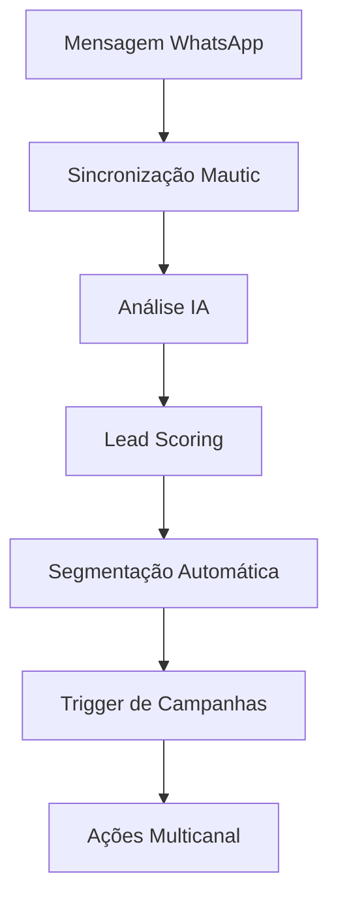

# Módulo 19: Mautic Marketing Automation - KRYONIX

## 📋 Visão Geral

O **Módulo 19** implementa um sistema completo de automação de marketing usando Mautic para a plataforma KRYONIX. Este módulo oferece:

- ✅ Integração nativa com Mautic self-hosted ou cloud
- ✅ Sincronização automática WhatsApp → Mautic → Email campaigns
- ✅ Lead scoring inteligente com IA integrada
- ✅ Campanhas omnichannel (Email + WhatsApp + Typebot)
- ✅ Templates específicos para o mercado brasileiro
- ✅ Compliance total LGPD/GDPR
- ✅ Automação de segmentação dinâmica
- ✅ Analytics avançados e reporting
- ✅ Multi-tenancy com isolamento completo
- ✅ Integração nativa com N8N workflows

## 🏗️ Arquitetura Implementada

### Database Entities

```
server/entities/
├── MauticInstance.ts          # Instâncias Mautic por tenant
├── MauticLead.ts             # Leads sincronizados com IA
└── MauticCampaign.ts         # Campanhas e automações
```

### Core Services

```
server/services/
├── mautic.ts                 # Serviço principal Mautic
└── mautic-integration-bridge.ts  # Integração com outros módulos
```

### API Routes

```
server/routes/
└── mautic.ts                 # API endpoints completa
```

### Templates

```
server/templates/
└── mautic-templates.ts       # Templates brasileiros
```

## 💾 Estrutura de Banco de Dados

### MauticInstance Entity

```sql
CREATE TABLE mautic_instances (
  id UUID PRIMARY KEY,
  tenant_id UUID REFERENCES tenants(id),
  name VARCHAR(255) NOT NULL,
  instance_url VARCHAR(500) NOT NULL,
  credentials JSONB NOT NULL, -- Encrypted OAuth credentials
  status instance_status DEFAULT 'INACTIVE',
  config JSONB NOT NULL,
  webhook_secret VARCHAR(255),
  sync_settings JSONB DEFAULT '{}',
  stats JSONB DEFAULT '{}',
  last_error TEXT,
  last_health_check TIMESTAMP,
  metadata JSONB,
  created_at TIMESTAMP DEFAULT NOW(),
  updated_at TIMESTAMP DEFAULT NOW()
);
```

### MauticLead Entity

```sql
CREATE TABLE mautic_leads (
  id UUID PRIMARY KEY,
  tenant_id UUID REFERENCES tenants(id),
  mautic_instance_id UUID REFERENCES mautic_instances(id),
  mautic_lead_id INTEGER,
  phone VARCHAR(20),
  email VARCHAR(255),
  lead_data JSONB NOT NULL,
  status lead_status DEFAULT 'NEW',
  sync_status sync_status DEFAULT 'PENDING',
  sync_metadata JSONB NOT NULL,
  ai_score FLOAT DEFAULT 0,
  ai_score_reason TEXT,
  engagement_score INTEGER DEFAULT 0,
  last_contacted_at TIMESTAMP,
  last_activity_at TIMESTAMP,
  tags JSONB,
  segments JSONB,
  campaigns JSONB,
  marketing_enabled BOOLEAN DEFAULT true,
  notes TEXT,
  metadata JSONB,
  created_at TIMESTAMP DEFAULT NOW(),
  updated_at TIMESTAMP DEFAULT NOW()
);
```

### MauticCampaign Entity

```sql
CREATE TABLE mautic_campaigns (
  id UUID PRIMARY KEY,
  tenant_id UUID REFERENCES tenants(id),
  mautic_instance_id UUID REFERENCES mautic_instances(id),
  mautic_campaign_id INTEGER,
  name VARCHAR(255) NOT NULL,
  description TEXT,
  type campaign_type DEFAULT 'CUSTOM',
  status campaign_status DEFAULT 'DRAFT',
  triggers JSONB NOT NULL,
  actions JSONB NOT NULL,
  settings JSONB NOT NULL,
  metrics JSONB DEFAULT '{}',
  start_date TIMESTAMP,
  end_date TIMESTAMP,
  target_segments JSONB,
  exclude_segments JSONB,
  is_published BOOLEAN DEFAULT true,
  last_error TEXT,
  priority INTEGER DEFAULT 0,
  metadata JSONB,
  created_at TIMESTAMP DEFAULT NOW(),
  updated_at TIMESTAMP DEFAULT NOW()
);
```

### Tipos Enum

```typescript
enum LeadSource {
  WHATSAPP = "WHATSAPP",
  TYPEBOT = "TYPEBOT",
  WEBSITE = "WEBSITE",
  SOCIAL_MEDIA = "SOCIAL_MEDIA",
  EMAIL = "EMAIL",
  API = "API",
  MANUAL = "MANUAL",
  IMPORTED = "IMPORTED",
}

enum CampaignType {
  EMAIL_SEQUENCE = "EMAIL_SEQUENCE",
  LEAD_NURTURING = "LEAD_NURTURING",
  WELCOME_SERIES = "WELCOME_SERIES",
  ABANDONED_CART = "ABANDONED_CART",
  RE_ENGAGEMENT = "RE_ENGAGEMENT",
  PRODUCT_LAUNCH = "PRODUCT_LAUNCH",
  SEASONAL = "SEASONAL",
  WEBINAR = "WEBINAR",
  CUSTOM = "CUSTOM",
}

enum TriggerType {
  LEAD_SCORE = "LEAD_SCORE",
  TAG_ADDED = "TAG_ADDED",
  SEGMENT_MEMBERSHIP = "SEGMENT_MEMBERSHIP",
  WHATSAPP_MESSAGE = "WHATSAPP_MESSAGE",
  AI_CLASSIFICATION = "AI_CLASSIFICATION",
  TIME_BASED = "TIME_BASED",
}
```

## 🎯 Fluxo de Automação Completo

### 1. Captura de Lead via WhatsApp



### 2. Pipeline de Processamento

```typescript
// Fluxo automático: WhatsApp → Mautic → IA → Campanhas
export class MauticIntegrationBridge {
  static async processWhatsAppMessage(
    message: Message,
    instance: WhatsAppInstance,
  ) {
    // 1. Sincronizar lead no Mautic
    const lead = await MauticService.syncFromWhatsApp(message);

    // 2. Enriquecer com IA
    const enrichment = await this.enrichLeadWithAI(lead, message);

    // 3. Atualizar segmentação
    const segments = await this.suggestSegments(lead, enrichment.aiAnalysis);

    // 4. Recomendar campanhas
    const campaigns = await this.recommendCampaigns(
      lead,
      enrichment.aiAnalysis,
    );

    // 5. Executar ações automáticas
    const actions = await this.generateNextActions(lead, enrichment.aiAnalysis);

    return { lead, enrichment, segments, campaigns, actions };
  }
}
```

## 🤖 Integração com IA (Módulo 18)

### Lead Scoring Inteligente

```typescript
// Análise automática de leads via IA
const profileResult = await AIService.processRequest(tenantId, {
  service: AIServiceType.OPENAI,
  operation: AIOperationType.TEXT_ANALYSIS,
  input: JSON.stringify({
    mensagem: message.content?.text,
    historico: lead.leadData,
    engajamento: lead.engagementScore,
  }),
  settings: {
    systemPrompt: `Analise este lead de marketing e atribua um score de 1-10 baseado em:
      
      Critérios de Scoring:
      - Interesse demonstrado na mensagem (1-3 pontos)
      - Qualidade da comunicação (1-2 pontos)  
      - Potencial de conversão (1-3 pontos)
      - Fit com produto/serviço (1-2 pontos)
      
      Retorne JSON com score, razão, categoria e próximas ações.`,
  },
});
```

### Análise de Sentimento e Intenção

```typescript
// Classificação automática de intenção
const intentResult = await AIService.processRequest(tenantId, {
  service: AIServiceType.OPENAI,
  operation: AIOperationType.INTENT_CLASSIFICATION,
  input: message.content?.text,
  settings: {
    systemPrompt: `Classifique a intenção desta mensagem WhatsApp em:
      - interesse_produto: interessado em produtos/serviços
      - solicita_informacao: pedindo informações
      - reclamacao: fazendo reclamação
      - elogio: dando feedback positivo
      - suporte: precisando de ajuda técnica
      - negociacao: negociando preços/condições
      - agendamento: querendo agendar algo
      - cancelamento: querendo cancelar algo`,
  },
});

// Análise de sentimento via Google AI
const sentimentResult = await AIService.processRequest(tenantId, {
  service: AIServiceType.GOOGLE,
  operation: AIOperationType.SENTIMENT_ANALYSIS,
  input: message.content?.text,
});
```

## 📱 Templates Específicos para o Mercado Brasileiro

### 1. Série de Boas-vindas Brasil

```typescript
const WELCOME_SERIES_BR = {
  name: "Série de Boas-vindas Brasil",
  type: CampaignType.WELCOME_SERIES,
  triggers: [
    {
      type: TriggerType.TAG_ADDED,
      conditions: { tags: ["novo_lead", "inscrito"] },
    },
  ],
  actions: [
    {
      type: "send_email",
      subject: "🎉 Bem-vindo(a) à nossa família!",
      content: `
Olá {{lead.firstname}}!

Seja muito bem-vindo(a)! Estamos felizes em tê-lo(a) conosco.

Nos próximos dias, você receberá:
✅ Dicas exclusivas sobre [SEU_SEGMENTO]
✅ Ofertas especiais só para você
✅ Conteúdo personalizado

📱 WhatsApp: {{company.whatsapp}}
📧 Email: {{company.email}}

P.S.: Salve nosso número no WhatsApp para receber dicas rápidas!
      `,
    },
    {
      type: "send_whatsapp",
      delay: 60, // 1 hora
      message:
        "👋 Oi {{lead.firstname}}! Acabamos de te enviar um email de boas-vindas. Que tal salvar nosso número? 😊",
    },
    {
      type: "send_email",
      delay: 1440, // 24 horas
      subject: "🎁 Presente especial para você!",
      content: `
🎁 [OFERTA_ESPECIAL] com 15% de desconto
💳 Pague no PIX e ganhe mais 5% off
🚚 Frete grátis para todo o Brasil

Use o código: BEMVINDO15
      `,
    },
  ],
  settings: {
    timezone: "America/Sao_Paulo",
    language: "pt_BR",
    respectBusinessHours: true,
    businessHours: { start: "09:00", end: "18:00" },
    avoidHolidays: true,
    holidaysList: ["2024-01-01", "2024-04-21", "2024-05-01", "2024-09-07"],
    requireConsent: true,
    unsubscribeLink: true,
  },
};
```

### 2. Recuperação de Carrinho Abandonado

```typescript
const ABANDONED_CART_BR = {
  name: "Recuperação de Carrinho Abandonado",
  type: CampaignType.ABANDONED_CART,
  triggers: [
    {
      type: TriggerType.CUSTOM_EVENT,
      conditions: { event: "cart_abandoned", delay_minutes: 30 },
    },
  ],
  actions: [
    {
      type: "send_whatsapp",
      delay: 30,
      message: `Oi {{lead.firstname}}! 🛒

Notamos que você deixou alguns itens no carrinho. Que tal finalizar sua compra?

🎁 Use VOLTA10 e ganhe 10% OFF
💳 PIX: mais 5% de desconto  
🚚 Frete GRÁTIS acima de R$ 99

⏰ Oferta válida por 24h!`,
    },
    {
      type: "send_email",
      delay: 120, // 2 horas
      subject: "⏰ Seus itens estão te esperando...",
      content: `
💡 Dica: Pague no PIX e economize mais 5%!

✨ OFERTA ESPECIAL:
• Código VOLTA10: 10% de desconto
• PIX: mais 5% off
• Frete grátis para todo o Brasil

Não perca essa oportunidade!
      `,
    },
  ],
};
```

### 3. Black Friday Brasil

```typescript
const BLACK_FRIDAY_BR = {
  name: "Campanha Black Friday Brasil",
  type: CampaignType.SEASONAL,
  actions: [
    {
      type: "send_whatsapp",
      message: `🔥 BLACK FRIDAY CHEGOU! 🔥

⚡ ATÉ 70% OFF
💳 PIX: mais 10% de desconto
🚚 Frete GRÁTIS para todo Brasil
🎁 Brindes exclusivos

⏰ CORRE! Ofertas limitadas!`,
    },
    {
      type: "send_email",
      delay: 30,
      subject: "🚨 BLACK FRIDAY: ATÉ 70% OFF + PIX 10% EXTRA!",
      content: `
🏷️ ATÉ 70% DE DESCONTO
💳 PIX: mais 10% off
🚚 FRETE GRÁTIS
🎁 BRINDES EXCLUSIVOS

⏰ Termina em: {{countdown}}
      `,
    },
  ],
  settings: {
    respectBusinessHours: false, // Black Friday pode enviar a qualquer hora
    throttling: {
      maxEmailsPerHour: 1000,
      maxWhatsAppPerHour: 500,
    },
  },
};
```

## 🔄 Integração com Outros Módulos

### WhatsApp Integration (Módulo 15)

```typescript
// Sincronização automática WhatsApp → Mautic
static async syncFromWhatsApp(message: Message): Promise<MauticLead | null> {
  // Buscar instâncias Mautic ativas
  const instances = await this.instanceRepo.find({
    where: {
      tenantId: message.tenantId,
      status: MauticInstanceStatus.ACTIVE
    }
  });

  if (instances.length === 0) return null;

  // Verificar lead existente
  let lead = await this.leadRepo.findOne({
    where: {
      tenantId: message.tenantId,
      phone: message.fromNumber
    }
  });

  if (lead) {
    // Atualizar engajamento
    lead.updateEngagementScore('whatsapp_message', 1);
  } else {
    // Criar novo lead
    const leadData = {
      phone: message.fromNumber,
      source: LeadSource.WHATSAPP,
      consentMarketing: false, // Precisa de consentimento explícito
      consentDataProcessing: true
    };

    lead = await this.createLead(instances[0].id, leadData, LeadSource.WHATSAPP);
  }

  return lead;
}
```

### Typebot Integration (Módulo 17)

```typescript
// Processamento de dados coletados via Typebot
static async processTypebotData(
  session: TypebotSession,
  collectedData: Record<string, any>
): Promise<void> {
  // Buscar ou criar lead
  let lead = await this.findOrCreateLead(session.tenantId, collectedData);

  if (lead) {
    // Atualizar dados coletados
    Object.assign(lead.leadData, collectedData);
    lead.updateEngagementScore('typebot_completion', 5);

    // Análise IA dos dados coletados
    const aiResult = await AIService.processRequest(session.tenantId, {
      service: AIServiceType.OPENAI,
      operation: AIOperationType.TEXT_ANALYSIS,
      input: JSON.stringify(collectedData),
      settings: {
        systemPrompt: 'Analise dados coletados via chatbot e forneça score e ações.'
      },
      sourceModule: AISourceModule.TYPEBOT
    });

    // Disparar workflows N8N
    await MauticIntegrationBridge.integrateWithN8N(lead, 'typebot_data_collected', {
      sessionId: session.id,
      collectedData
    });
  }
}
```

### N8N Workflows Integration (Módulo 16)

```typescript
// Trigger automático de workflows N8N baseado em eventos Mautic
static async integrateWithN8N(
  lead: MauticLead,
  event: string,
  data?: any
): Promise<string[]> {
  const workflowMappings = {
    'lead_created': ['mautic_lead_created', 'lead_scoring_workflow'],
    'high_score_achieved': ['hot_lead_notification', 'sales_alert_workflow'],
    'negative_sentiment': ['customer_recovery_workflow', 'urgent_response_workflow'],
    'campaign_completed': ['post_campaign_analysis', 'next_campaign_trigger']
  };

  const workflows = workflowMappings[event] || [];
  const triggered = [];

  for (const workflowId of workflows) {
    await N8NService.triggerWorkflow(workflowId, {
      leadId: lead.id,
      tenantId: lead.tenantId,
      event,
      leadData: lead.leadData,
      aiScore: lead.aiScore,
      ...data
    });
    triggered.push(workflowId);
  }

  return triggered;
}
```

## 🌐 API Endpoints

### Instance Management

```http
POST   /api/v1/mautic/instances                    # Criar instância Mautic
GET    /api/v1/mautic/instances                    # Listar instâncias
GET    /api/v1/mautic/instances/:instanceId        # Obter instância específica
POST   /api/v1/mautic/instances/:instanceId/test   # Testar conexão
```

### Lead Management

```http
POST   /api/v1/mautic/instances/:instanceId/leads  # Criar lead
GET    /api/v1/mautic/leads                        # Listar leads
GET    /api/v1/mautic/leads/:leadId                # Obter lead específico
PUT    /api/v1/mautic/leads/:leadId                # Atualizar lead
POST   /api/v1/mautic/leads/:leadId/sync           # Sincronizar lead
POST   /api/v1/mautic/leads/bulk-action            # Ação em lote
```

### Campaign Management

```http
POST   /api/v1/mautic/instances/:instanceId/campaigns     # Criar campanha
GET    /api/v1/mautic/campaigns                           # Listar campanhas
POST   /api/v1/mautic/campaigns/:campaignId/execute       # Executar campanha
```

### Templates e Analytics

```http
GET    /api/v1/mautic/templates                           # Listar templates
POST   /api/v1/mautic/instances/:instanceId/templates/:templateName  # Criar de template
GET    /api/v1/mautic/analytics                           # Analytics do tenant
```

### LGPD Compliance

```http
POST   /api/v1/mautic/lgpd/data-request                   # Solicitações LGPD
```

### Webhooks

```http
POST   /api/webhooks/mautic/:tenantId/:instanceId         # Webhooks Mautic
```

## 📊 Exemplos de Uso da API

### 1. Criar Instância Mautic

```javascript
const response = await fetch("/api/v1/mautic/instances", {
  method: "POST",
  headers: {
    Authorization: "Bearer your-jwt-token",
    "Content-Type": "application/json",
  },
  body: JSON.stringify({
    name: "Mautic Principal",
    instanceUrl: "https://mautic.minhaempresa.com.br",
    credentials: {
      clientId: "mautic_client_id",
      clientSecret: "mautic_client_secret",
    },
    config: {
      autoSync: true,
      syncInterval: 30,
      webhookEnabled: true,
      leadScoringEnabled: true,
      aiIntegrationEnabled: true,
      lgpdComplianceEnabled: true,
    },
  }),
});

const instance = await response.json();
console.log("Instância criada:", instance.data.id);
```

### 2. Criar Lead Manualmente

```javascript
const response = await fetch(`/api/v1/mautic/instances/${instanceId}/leads`, {
  method: "POST",
  headers: {
    Authorization: "Bearer your-jwt-token",
    "Content-Type": "application/json",
  },
  body: JSON.stringify({
    firstName: "João",
    lastName: "Silva",
    email: "joao.silva@email.com",
    phone: "+5511999999999",
    company: "Empresa LTDA",
    cpf: "123.456.789-10",
    city: "São Paulo",
    state: "SP",
    region: "Sudeste",
    source: "WEBSITE",
    consentMarketing: true,
    consentDataProcessing: true,
    customFields: {
      interesse: "Produto A",
      orcamento: "R$ 10.000 - R$ 50.000",
    },
  }),
});

const lead = await response.json();
console.log("Lead criado:", lead.data.id);
```

### 3. Criar Campanha de Template

```javascript
const response = await fetch(
  `/api/v1/mautic/instances/${instanceId}/templates/WELCOME_SERIES_BR`,
  {
    method: "POST",
    headers: {
      Authorization: "Bearer your-jwt-token",
      "Content-Type": "application/json",
    },
    body: JSON.stringify({
      name: "Boas-vindas - Novos Clientes 2024",
      customizations: {
        settings: {
          businessHours: {
            start: "08:00",
            end: "20:00",
          },
        },
        actions: [
          {
            type: "send_email",
            customizations: {
              fromName: "Equipe MinhaEmpresa",
              fromEmail: "contato@minhaempresa.com.br",
            },
          },
        ],
      },
    }),
  },
);

const campaign = await response.json();
console.log("Campanha criada:", campaign.data.id);
```

### 4. Analytics do Tenant

```javascript
const response = await fetch("/api/v1/mautic/analytics", {
  headers: {
    Authorization: "Bearer your-jwt-token",
  },
});

const analytics = await response.json();
console.log("Métricas:", {
  totalLeads: analytics.data.overview.totalLeads,
  qualifiedLeads: analytics.data.overview.qualifiedLeads,
  activeCampaigns: analytics.data.overview.activeCampaigns,
  leadSources: analytics.data.leadSources,
  regionalDistribution: analytics.data.regionalDistribution,
});
```

### 5. Ação em Lote nos Leads

```javascript
const response = await fetch("/api/v1/mautic/leads/bulk-action", {
  method: "POST",
  headers: {
    Authorization: "Bearer your-jwt-token",
    "Content-Type": "application/json",
  },
  body: JSON.stringify({
    leadIds: ["lead1-uuid", "lead2-uuid", "lead3-uuid"],
    action: "add_tag",
    params: {
      tag: "black_friday_2024",
    },
  }),
});

const result = await response.json();
console.log(`Tag adicionada a ${result.data.updatedLeads} leads`);
```

## 🔐 Compliance LGPD

### Sistema de Consentimento

```typescript
interface LeadData {
  // Campos de consentimento LGPD
  consentMarketing: boolean; // Consentimento para marketing
  consentDataProcessing: boolean; // Consentimento para processamento
  consentTimestamp: Date; // Timestamp do consentimento

  // Controles de privacidade
  marketingEnabled: boolean; // Pode receber marketing
  dataRetentionDays: number; // Período de retenção
}

// Métodos de compliance
export class MauticLead {
  hasMarketingConsent(): boolean {
    return this.leadData.consentMarketing === true && this.marketingEnabled;
  }

  revokeConsent(type: "marketing" | "data_processing"): void {
    if (type === "marketing") {
      this.leadData.consentMarketing = false;
      this.marketingEnabled = false;
    }
    this.leadData.consentTimestamp = new Date();
    this.syncStatus = SyncStatus.PENDING; // Sync para atualizar Mautic
  }

  exportData(): Record<string, any> {
    return {
      personalData: {
        /* dados pessoais */
      },
      activityData: {
        /* dados de atividade */
      },
      consentData: {
        /* dados de consentimento */
      },
      metadata: {
        /* metadados */
      },
    };
  }
}
```

### Endpoint LGPD

```javascript
// Solicitação de exportação de dados
const exportResponse = await fetch("/api/v1/mautic/lgpd/data-request", {
  method: "POST",
  headers: {
    Authorization: "Bearer your-jwt-token",
    "Content-Type": "application/json",
  },
  body: JSON.stringify({
    contactPhone: "+5511999999999",
    requestType: "export",
  }),
});

// Solicitação de exclusão de dados
const deleteResponse = await fetch("/api/v1/mautic/lgpd/data-request", {
  method: "POST",
  headers: {
    Authorization: "Bearer your-jwt-token",
    "Content-Type": "application/json",
  },
  body: JSON.stringify({
    contactPhone: "+5511999999999",
    requestType: "delete",
  }),
});
```

## 📈 Analytics e Métricas

### Dashboard de Performance

```typescript
interface MauticAnalytics {
  overview: {
    totalInstances: number;
    activeInstances: number;
    totalLeads: number;
    qualifiedLeads: number;
    totalCampaigns: number;
    activeCampaigns: number;
  };

  leadSources: Record<string, number>; // Distribuição por fonte
  leadsByStatus: Record<string, number>; // Distribuição por status

  engagementMetrics: {
    averageAIScore: number;
    averageEngagementScore: number;
    totalInteractions: number;
  };

  campaignPerformance: Array<{
    id: string;
    name: string;
    type: CampaignType;
    status: CampaignStatus;
    performance: {
      overview: {
        totalContacts: number;
        completionRate: number;
        conversionRate: number;
      };
      email: {
        sent: number;
        openRate: number;
        clickRate: number;
        bounceRate: number;
      };
      whatsapp: {
        sent: number;
        deliveryRate: number;
        readRate: number;
        replyRate: number;
      };
    };
  }>;

  regionalDistribution: Record<string, number>;
}
```

### Otimizações Automáticas

```typescript
// Sugestões de otimização baseadas em performance
export class MauticCampaign {
  getOptimizationSuggestions(): string[] {
    const suggestions: string[] = [];
    const report = this.getPerformanceReport();

    if (report.email.openRate < 0.2) {
      suggestions.push("Melhorar assunto dos emails - taxa de abertura baixa");
    }

    if (report.email.clickRate < 0.05) {
      suggestions.push("Melhorar CTAs e conteúdo - taxa de clique baixa");
    }

    if (report.whatsapp.replyRate < 0.1) {
      suggestions.push("Tornar mensagens WhatsApp mais interativas");
    }

    if (report.overview.conversionRate < 0.05) {
      suggestions.push("Revisar ofertas e call-to-actions");
    }

    return suggestions;
  }
}
```

## 🚀 Setup e Configuração

### 1. Configuração Básica

```env
# Mautic Configuration (opcional - pode ser configurado via UI)
MAUTIC_DEFAULT_URL=https://mautic.empresa.com.br
MAUTIC_DEFAULT_CLIENT_ID=client_id_opcional
MAUTIC_DEFAULT_CLIENT_SECRET=client_secret_opcional

# LGPD Configuration
LGPD_DATA_RETENTION_DAYS=365
LGPD_CONSENT_REQUIRED=true
LGPD_AUDIT_ENABLED=true
```

### 2. Primeira Configuração

```typescript
// 1. Criar instância Mautic
const instance = await MauticService.createInstance(tenantId, {
  name: "Mautic Principal",
  instanceUrl: "https://mautic.empresa.com.br",
  credentials: {
    clientId: "seu_client_id",
    clientSecret: "seu_client_secret",
  },
});

// 2. Testar conexão
const isConnected = await MauticService.testConnection(instance.id);

// 3. Criar campanha de boas-vindas
const welcomeCampaign = await MauticService.createCampaign(instance.id, {
  name: "Boas-vindas Automáticas",
  type: CampaignType.WELCOME_SERIES,
  triggers: [
    {
      type: TriggerType.TAG_ADDED,
      conditions: { tags: ["novo_lead"] },
    },
  ],
  actions: [
    {
      type: "send_email",
      subject: "Bem-vindo!",
      content: "Conteúdo de boas-vindas",
    },
  ],
});
```

### 3. Integração com WhatsApp

```typescript
// Configurar sincronização automática WhatsApp → Mautic
export class WhatsAppService {
  static async handleIncomingMessage(
    message: Message,
    instance: WhatsAppInstance,
  ) {
    // Processar com Mautic automaticamente
    const result = await MauticIntegrationBridge.processWhatsAppMessage(
      message,
      instance,
    );

    if (result.success) {
      console.log(
        `Lead ${result.leadId} processado com score ${result.aiScore}`,
      );

      // Executar ações automáticas baseadas no score
      if (result.aiScore >= 8) {
        await this.notifyHotLead(result.leadId);
      }
    }
  }
}
```

## 🧪 Testes e Validação

### Teste de Integração

```bash
# Testar criação de instância
curl -X POST \
  -H "Authorization: Bearer $JWT_TOKEN" \
  -H "Content-Type: application/json" \
  -d '{
    "name": "Teste Mautic",
    "instanceUrl": "https://demo.mautic.org",
    "credentials": {
      "clientId": "test_client",
      "clientSecret": "test_secret"
    }
  }' \
  http://localhost:8080/api/v1/mautic/instances

# Testar criação de lead
curl -X POST \
  -H "Authorization: Bearer $JWT_TOKEN" \
  -H "Content-Type: application/json" \
  -d '{
    "firstName": "João",
    "lastName": "Teste",
    "email": "joao@teste.com",
    "phone": "+5511999999999",
    "source": "API",
    "consentMarketing": true
  }' \
  http://localhost:8080/api/v1/mautic/instances/$INSTANCE_ID/leads
```

### Health Check

```bash
curl -H "Authorization: Bearer $JWT_TOKEN" \
  http://localhost:8080/api/v1/mautic/health

# Resposta:
{
  "success": true,
  "service": "Mautic Marketing Automation",
  "status": "healthy",
  "features": {
    "leadManagement": true,
    "campaignAutomation": true,
    "emailMarketing": true,
    "whatsappIntegration": true,
    "aiIntegration": true,
    "lgpdCompliance": true,
    "brazilianMarket": true
  }
}
```

## 🔧 Troubleshooting

### Problemas Comuns

#### 1. Erro de Autenticação Mautic

- Verificar Client ID e Client Secret
- Validar URL da instância Mautic
- Conferir configurações OAuth no Mautic

#### 2. Lead Não Sincroniza

- Verificar status da instância Mautic
- Validar dados obrigatórios do lead
- Conferir limites de API do Mautic

#### 3. Campanha Não Executa

- Verificar se campanha está publicada
- Validar triggers e condições
- Conferir permissões de consentimento

#### 4. WhatsApp Não Integra

- Verificar se instância WhatsApp está ativa
- Validar configurações de webhook
- Conferir mapeamento de campos

## 📚 Próximas Integrações

O Módulo 19 se integra perfeitamente com:

### **Módulo 20: Sistema de Notificações**

- Alertas em tempo real para leads quentes
- Notificações de campanhas completadas
- Alertas de problemas de sincronização

### **Módulos Futuros**

- CRM integration (HubSpot, Pipedrive)
- Advanced analytics e BI
- Marketing attribution tracking

---

**✅ Módulo 19 - Mautic Marketing Automation: CONCLUÍDO**

_Próximo: Módulo 20 - Sistema de Notificações_

## 📊 Métricas de Implementação

- **Entities:** 3 entidades principais (MauticInstance, MauticLead, MauticCampaign)
- **Templates:** 10+ templates para mercado brasileiro
- **API Endpoints:** 20+ endpoints para gestão completa
- **Integrações:** WhatsApp, Typebot, N8N, AI Services nativas
- **Campanhas:** Email + WhatsApp + Typebot omnichannel
- **Compliance:** LGPD total com exportação e exclusão de dados
- **Analytics:** Dashboard completo com métricas de performance
- **Automação:** Lead scoring, segmentação e campanhas automáticas
- **Multi-tenancy:** Isolamento completo + configurações personalizadas
- **Templates Brasileiros:** Específicos para Black Friday, Dia das Mães, etc.

**🎯 Sistema de marketing automation completo e robusto que transforma a experiência de relacionamento da plataforma KRYONIX com foco total no mercado brasileiro!**
